# Create Foundry Instances

## Stacks

| Resource                | Primary                     | Secondary                    |
| ----------------------- | --------------------------- | ---------------------------- |
| Region                  | `eastus`                    | `eastus2`                    |
| Log Analytics Workspace | `-eastus-law`               | -`eastus2-law`               |
| App Insights            | `-eastus-appi`              | -`eastus2-appi`              |
| Foundry Instances       | `-eastus-foundry-{purpose}` | -`eastus2-foundry-{purpose}` |

## Log Analytics Workspace

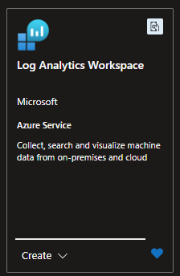

We will funnel of our logs into App Insights for monitoring and diagnostics, using log analytics workspace.

Since Foundry will be deployed across multiple regions, it is considered best practice to create Log Analytics Workspace in each region to collect and analyze logs.

For tutorial purposes, you can create only 1 Log Analytics Workspace + App Insights, however, we wanted to call it out.

| Resource                | Primary       | Secondary (Optional) |
| ----------------------- | ------------- | -------------------- |
| Log Analytics Workspace | `-eastus-law` | -`eastus2-law`       |

<table>
  <thead>
    <tr>
      <th>eastus</th>
      <th>eastus2</th>
    </tr>
  </thead>
  <tbody>
    <tr>
      <td>
        <ul>
            <li>Name: <pre>ai-gw-{stack-id}-eastus-law</pre></li>
            <li>Region: <pre>(US) East US`.- `eastus`</pre></li>
        </ul>
      </td>
      <td>
        <ul>
            <li>Name: <pre>ai-gw-{stack-id}-eastus2-law</pre></li>
            <li>Region: <pre>(US) East US 2`.- `eastus2`</pre></li>
        </ul>
      </td>
    </tr>
  </tbody>
</table>

### Basics

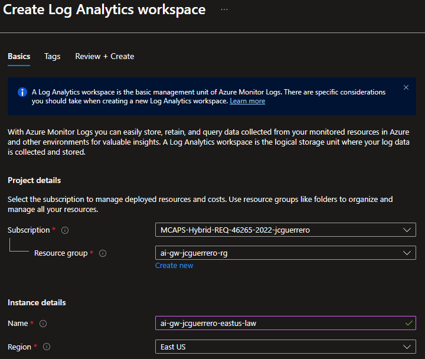

### Review + create

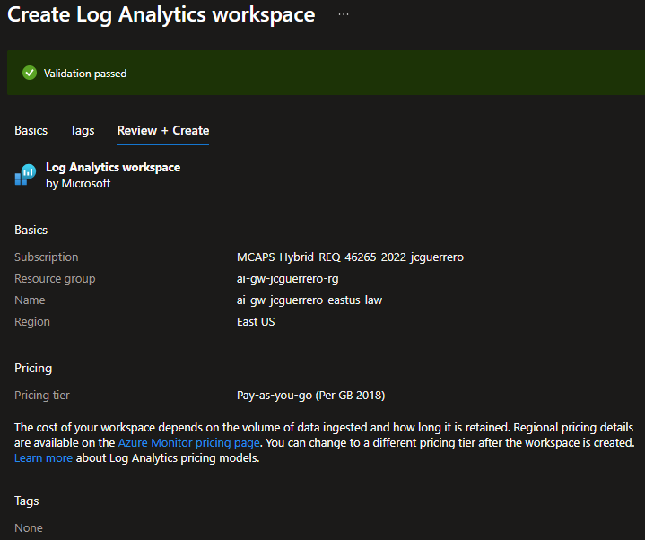

### Snapshot

You should end up with this

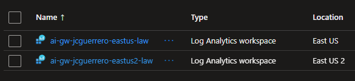

## App Insights

For each LAW, we will create an App Insights instance to collect and analyze telemetry data.

| Resource     | Primary        | Secondary       |
| ------------ | -------------- | --------------- |
| App Insights | `-eastus-appi` | -`eastus2-appi` |

If you only created 1 Log Analytics Workspace, only create 1 App Insights instance.

<table>
  <thead>
    <tr>
      <th>eastus</th>
      <th>eastus2</th>
    </tr>
  </thead>
  <tbody>
    <tr>
      <td>
        <ul>
            <li>Name: <pre>ai-gw-{stack-id}-eastus-appi</pre></li>
            <li>Region: <pre>(US) East US`.- `eastus`</pre></li>
            <li>Log Analytics Workspace: <pre>ai-gw-{stack-id}-eastus-law</pre> (created above)</li>
        </ul>
      </td>
      <td>
        <ul>
            <li>Name: <pre>ai-gw-{stack-id}-eastus2-appi</pre></li>
            <li>Region: <pre>(US) East US 2`.- `eastus2`</pre></li>
            <li>Log Analytics Workspace: <pre>ai-gw-{stack-id}-eastus2-law</pre> (created above)</li>
        </ul>
      </td>
    </tr>
  </tbody>
</table>

### Basics

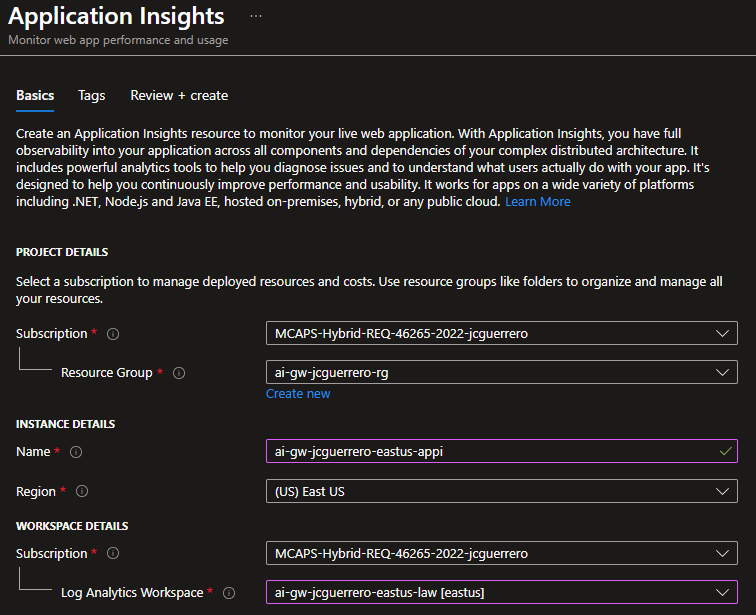

### Snapshot

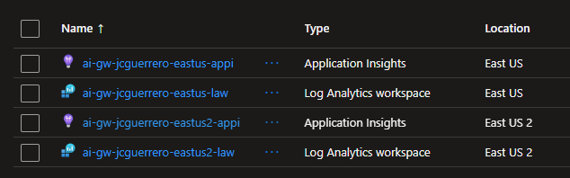

#### Resource Visualization

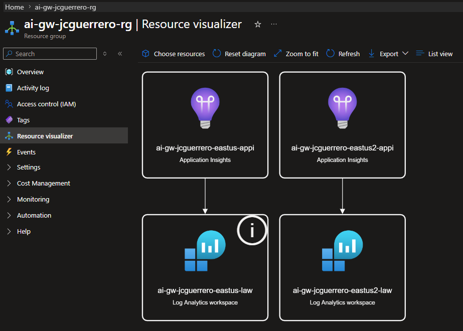

## Foundry Instances

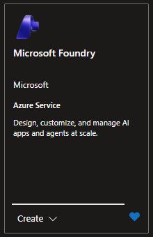

For foundry, we will create 2 instances.

1. One will represent (pre-)[P]aid [T]oken [U]sage: `ptu`
2. The other is a [P]ay [a]s [y]ou [G]o fallback instance: `payg`

| Instance | Name                                    | Region                       |
| -------- | --------------------------------------- | ---------------------------- |
| PTU      | `ai-gw-{stack-id}-eastus-foundry-ptu`   | `(US) East US`.- `eastus`    |
| PAYG     | `ai-gw-{stack-id}-eastus2-foundry-payg` | `(US) East US 2`.- `eastus2` |

<table>
  <thead>
    <tr>
      <th>eastus</th>
      <th>eastus2</th>
    </tr>
  </thead>
  <tbody>
    <tr>
      <td>
        <ul>
            <li>Name: <pre>ai-gw-{stack-id}-eastus-foundry-ptu</pre></li>
            <li>Region: <pre>(US) East US`.- `eastus`</pre></li>
            <li>Default project name: <pre>ai-gw-{stack-id}-eastus-foundry-ptu-proj</pre></li>
            <li>Application Insights: <pre>ai-gw-{stack-id}-eastus-appi</pre> (created above)</li>
        </ul>
      </td>
      <td>
        <ul>
            <li>Name: <pre>ai-gw-{stack-id}-eastus2-foundry-payg</pre></li>
            <li>Region: <pre>(US) East US 2`.- `eastus2`</pre></li>
            <li>Default project name: <pre>ai-gw-{stack-id}-eastus2-foundry-payg-proj</pre></li>
            <li>Application Insights: <pre>ai-gw-{stack-id}-eastus2-appi</pre> (created above)</li>
        </ul>
      </td>
    </tr>
  </tbody>
</table>

### Basics

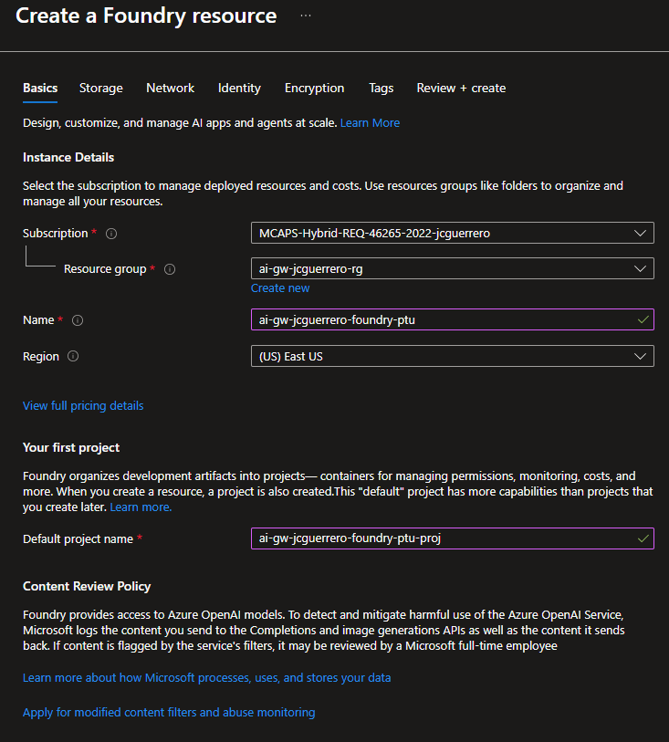

### Storage

#### Credential storage and application logging

- Application Insights: `ai-gw-{stack-id}-eastus-appi` (created above)

### Network

Leave as-is

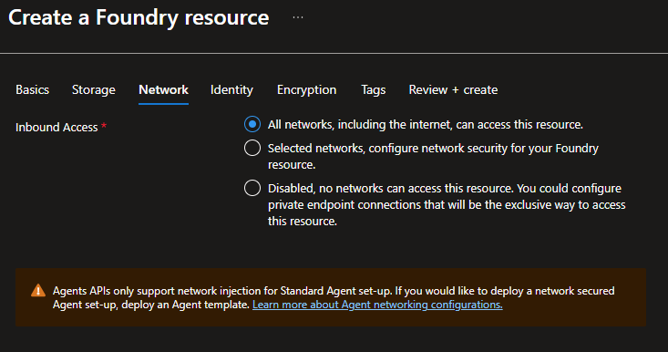

> [!WARN]
> This is not production grade. For a guide using VPNs, see [Azure Secure Networking for Devs](https://github.com/percebus/azure-secure-networking-for-devs/)

### Identity

Leave as-is

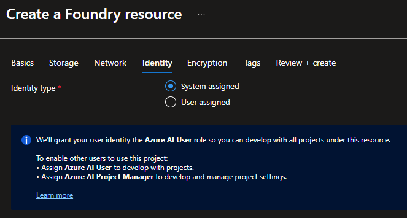

### Encryption

Leave as-is

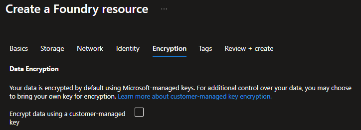

### Review + create

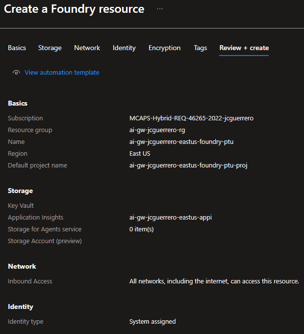

### Snapshot

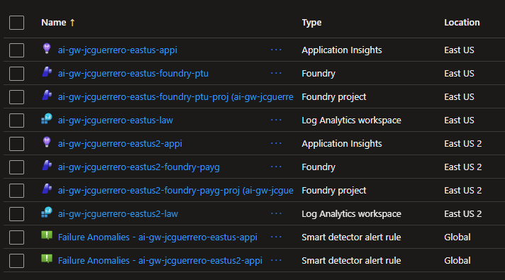
