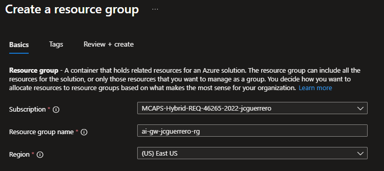
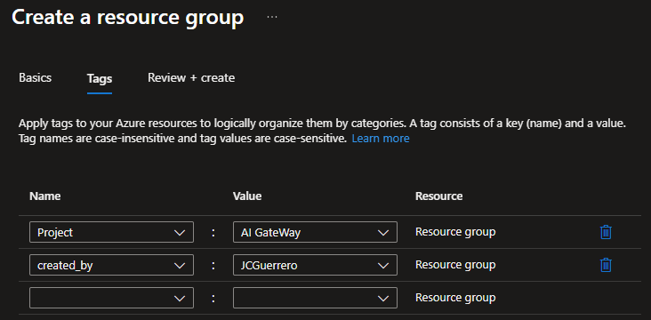
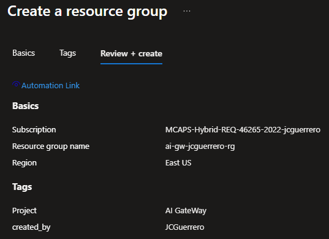

# Create a Resource Group

## About Stack Id

A Stack Identifier is something that allows us to deploy the same Infrastructure in the same region multiple times without conflicts.

For this tutorial, just use your username (i.e. `jcguerrero`)

> [!WARN]
> Normally, we would add `region` to `rg`. But in this case: the RG will contain resources accross multiple regions.

## Region(s)

- For lots of the US resources, `eastus` is Azure's preferred region. So will use that as our Primary region.
- Some of the advanced OpenAI deployment models, are only available in certain regions, such as `eastus2`. So We'll use that as our Secondary region.

## Resource Group

### Basics

- Subscription: <your-subscription-id>
- Resource Group: `ai-gw-{stack-id}-rg`
- Region: `(US) East US`.- `eastus`

\*

### Tags

Always tag your resources. Or at the very least the Resource Group.

### Review + create

