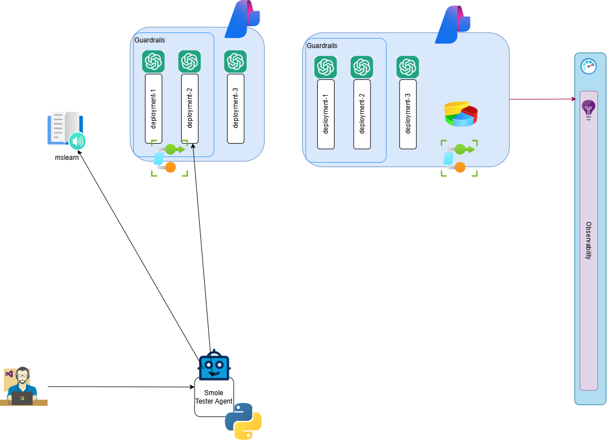

# Module 2: LLM Deployment models & smoke testing

## Summary

Deploy LLM models in Foundry and validate they respond correctly using the included Python client.

## Motivation

Before adding a gateway layer, confirm the AI backend is functional. This module also introduces model versioning strategies that matter for production stability.

## Use cases

- Deploying multiple model versions (latest vs stable) for safe roll-outs
- Choosing upgrade policies: auto-upgrade vs expire-on-EOL
- Validating model responses before exposing through a gateway

## Skills learned

- Deploying `gpt-4.1-mini` with Global Standard deployment type
- Configuring model version upgrade policies
- Understanding TPM (Tokens Per Minute) quotas and their shared nature
- Navigating New vs Classic Foundry portal views
- Running the Python smoke test client

## Chapters

1. [Foundry](./foundry.md)
1. [Python tester](./python.md)

## Goal

## Next

[Back to Modules](../README.md)
