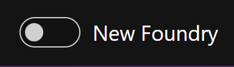
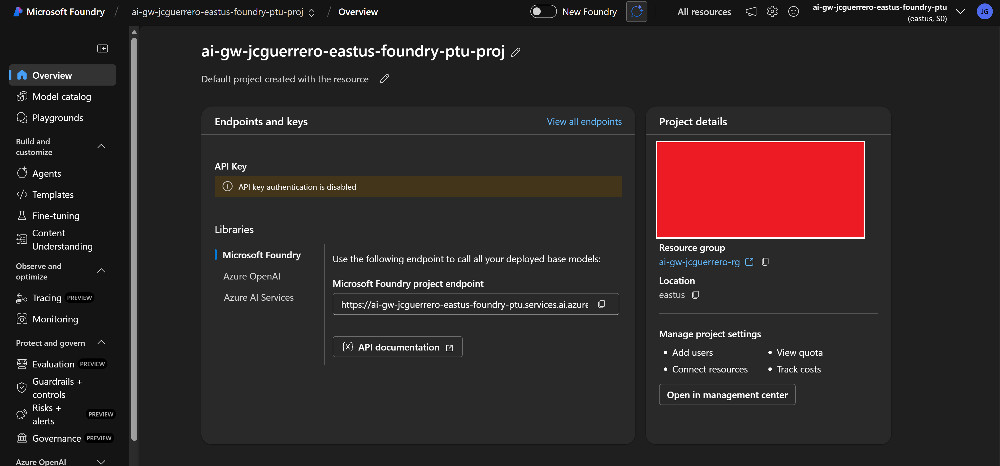
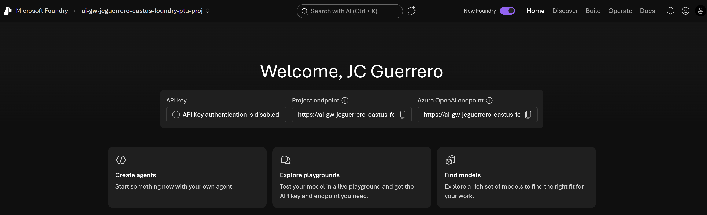
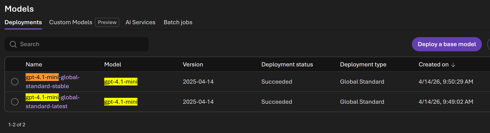
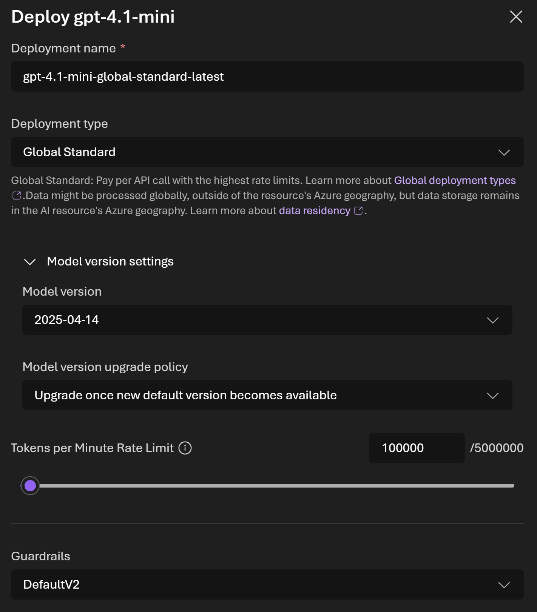
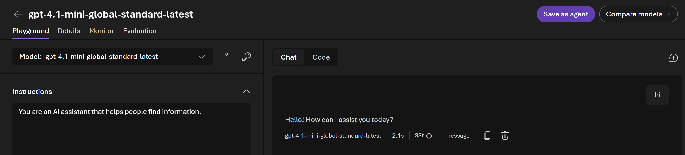
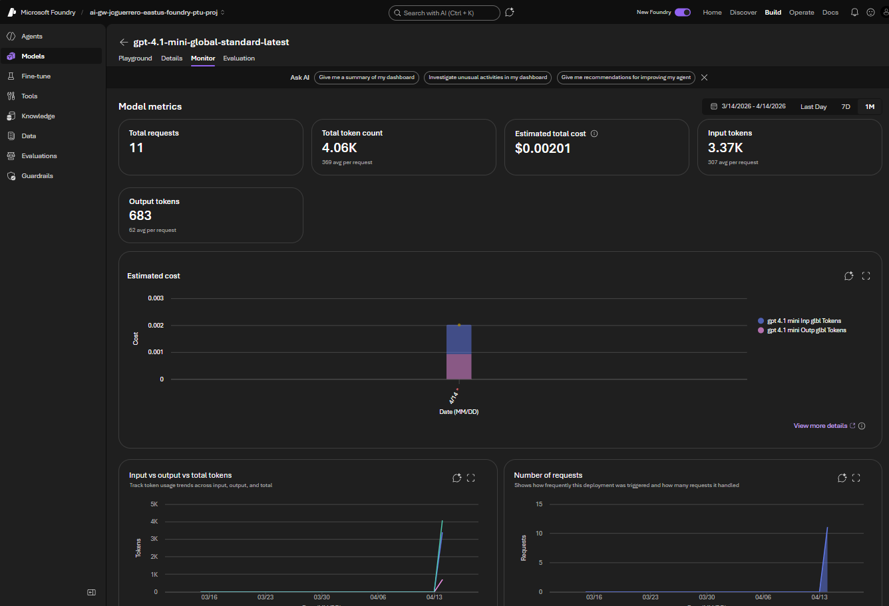
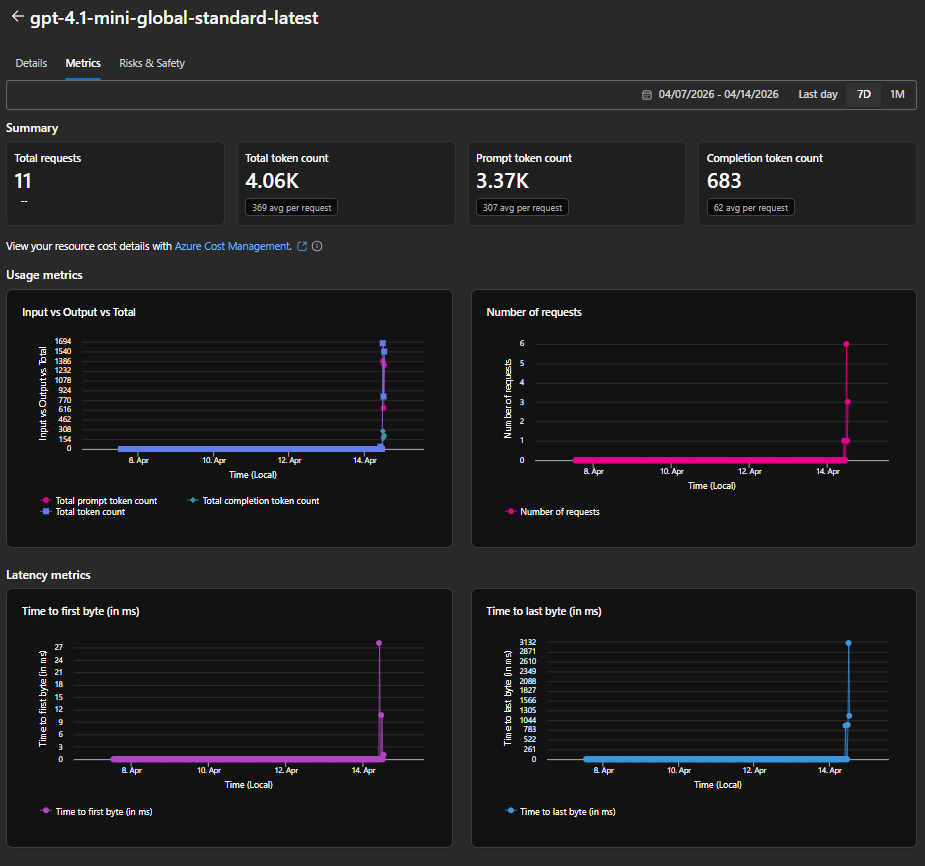

# LLM Deployment models

Once you've created your Foundry instances, head over to the `ptu` instance to configure your deployment models.

1. Click on foundry resource
2. Overview
3. Click on [ Go to Foundry portal ]

## New VS classic foundry

You will see this toggle:

| Mode    | img                                                                                 |
| ------- | ----------------------------------------------------------------------------------- |
| Classic |  |
| New     |              |

Make sure you familiarize with both views.

- As some new content is only available in the new Foundry view.
- But some other has not been migrated, only being available in "Classic" (old) Foundry.

## Models

We will create the following deployment models:

| region  | name | model          | deployment-name                       | Model upgrade policy | TPM  | Guardrails  |
| ------- | ---- | -------------- | ------------------------------------- | -------------------- | ---- | ----------- |
| eastus  | ptu  | `gpt-4.1-mini` | `gpt-4.1-mini-global-standard-latest` | "Upgrade"            | 100K | `DefaultV2` |
| eastus  | ptu  | `gpt-4.1-mini` | `gpt-4.1-mini-global-standard-stable` | "Expires"            | 100K | `DefaultV2` |
| eastus2 | payg | `gpt-4.1-mini` | `gpt-4.1-mini-global-standard-latest` | "Upgrade"            | 100K | `DefaultV2` |
| eastus2 | payg | `gpt-4.1-mini` | `gpt-4.1-mini-global-standard-stable` | "Expires"            | 100K | `DefaultV2` |

At the end, we will have the following deployment models configured:

| deployment name                       | eastus | eastus2 | Model upgrade policy |
| ------------------------------------- | ------ | ------- | -------------------- |
| `gpt-4.1-mini-global-standard-latest` | ✅     | ✅      | "Upgrade"            |
| `gpt-4.1-mini-global-standard-stable` | ✅     | ✅      | "Expires"            |

### PTU

For this exercise, we will be using the "New Foundry" view.

> [!NOTE]
> Be sure to go back and forth between the "New" and "Classic" Foundry views to familiarize yourself with both.

We'll be creating the following deployment models in the PTU instance.-

| latest                                                                                                                                                | stable                                                                                                                                                |
| ----------------------------------------------------------------------------------------------------------------------------------------------------- | ----------------------------------------------------------------------------------------------------------------------------------------------------- |
|  |  |

#### gpt-4.1-mini-global-standard-latest

1. Click Build > Models
1. Click ( Deploy a base model )
1. Choose `gpt-4.1-mini`
1. Click ( Deploy v ) > "Custom settings"
1. Choose these settings

- **Deployment name**: `gpt-4.1-mini-global-standard-latest`
- **Deployment type**: "Global Standard" (as-is)
- > **Model version settings**
  - **Model version**: (latest)
  - **Model version upgrade policy**: "Upgrade once new default version becomes available"
- **Tokens per Minute Rate Limit**: `100000` (100K)
- **Guardrails**: `DefaultV2`

> [!WARNING]
> Tokens per minute is shared across ALL GPT deployments. If you choose a high value, you won't be able to create subsequent deployment models.

#### gpt-4.1-mini-global-standard-stable

We will follow the same steps as above, but with a different model version upgrade policy.

**Model version upgrade policy**: "Once the current version expires" <<< THIS IS DIFFERENT

1. Click Build > Models
1. Click ( Deploy a base model )
1. Choose `gpt-4.1-mini`
1. Click ( Deploy v ) > "Custom settings"
1. Choose these settings

- **Deployment name**: `gpt-4.1-mini-global-standard-stable`
- **Deployment type**: "Global Standard" (as-is)
- > **Model version settings**
  - **Model version**: (latest)
  - **Model version upgrade policy**: "Once the current version expires" <<< THIS IS DIFFERENT
- **Tokens per Minute Rate Limit**: `100000` (100K)
- **Guardrails**: `DefaultV2`

#### Test

1. Go to Model > Playground
1. Type "Hi" and click "Send" (paper plane)

#### Monitor / metrics

On the deployment model, click on the [ Metrics ] tab (Classic), or [ Monitor ] tab (New Foundry view).

| mode        | img                                                                                                                                     |
| ----------- | --------------------------------------------------------------------------------------------------------------------------------------- |
| Classic     |  |
| New Foundry |      |

### PayG

Now, switch to the PayG instance to configure the same deployment models.

## Next

[Back to Module](./README.md)
