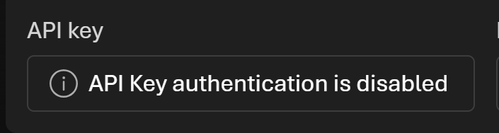

# Python tester

You can start interacting w/ your deployment model using the Python solution included under the `python/` folder

[See the `README.md` to get started](../../../python/)

> [!WARNING]
> If you don't have permissions to generate API keys, don't worry! We will login thru APIM in the next module.

