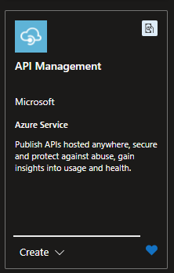
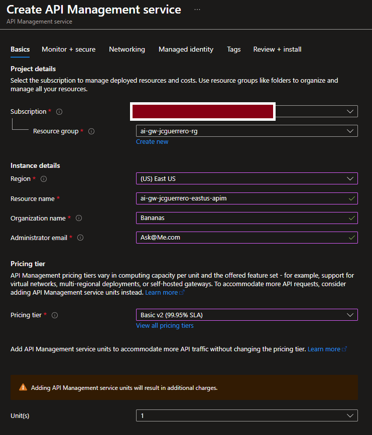
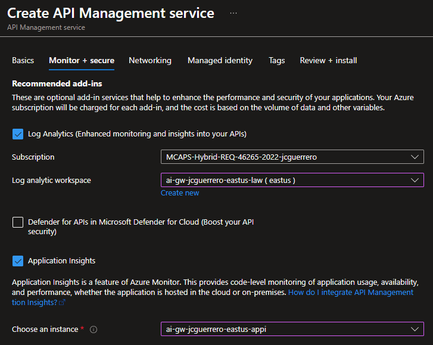
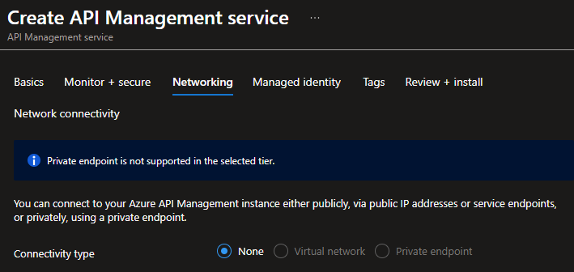
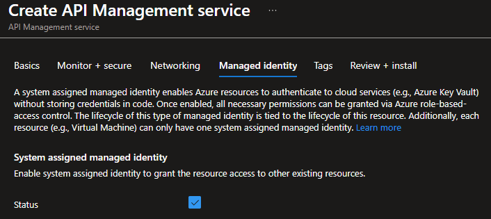
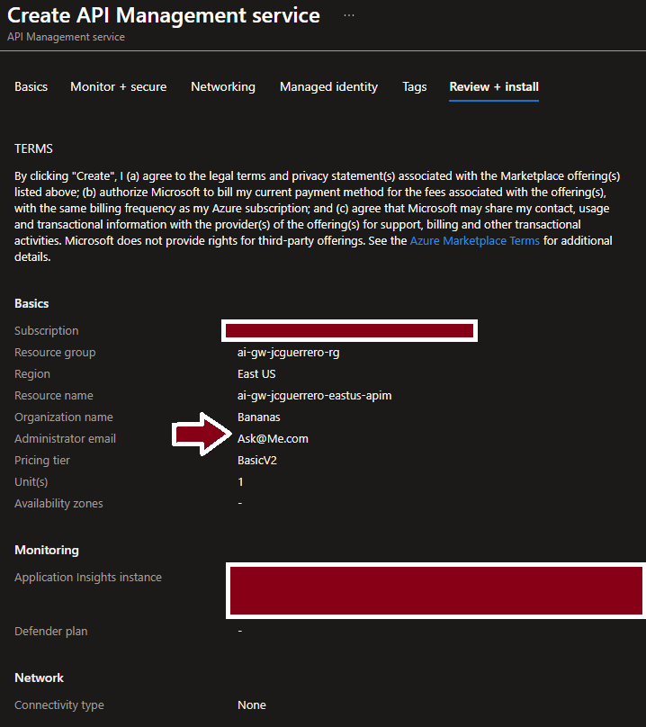
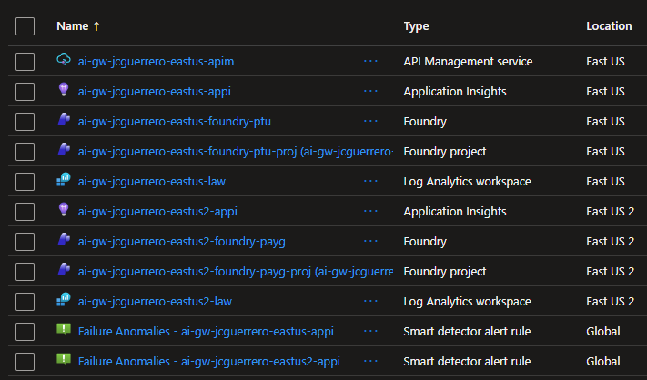
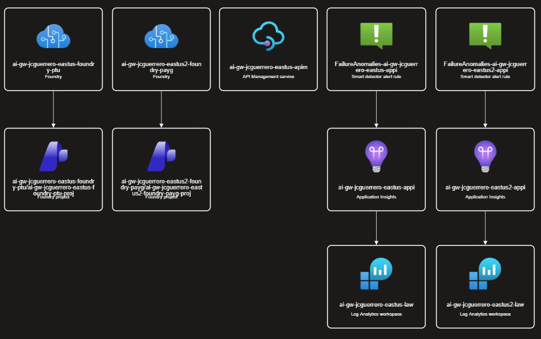

# Azure API [M]anagement

We'll create an instance in the primary region `eastus`

Bear in mind that APIM can span across multiple regions for high availability and disaster recovery purposes.

> [!WARNING]
> We'll work w/ v2 tiers. You CANNOT change from v1 (Like "Developer" or "Basic") to v2.

> [!WARNING]
> Creation can take up to 30 minutes

## Create

### Basics

#### Instance details

- Resource name: `ai-gw-{stack-id}-eastus-apim`
- Organization name: Something like `Bananas`
- Administrator email: Your email.- You will get msgs from APIM w/e a new user gets registered

#### Pricing tier

- Pricing tier: `Basic v2`.

> [!WARNING]
> APIM Can be EXPENSIVE. Even the Basic v2 tier can cost up to $500/mo

- Unit(s): 1

### Monitor + secure

#### Recommended add-ins

- [x] Log Analytics (Enhanced monitoring and insights into your APIs)
  - Log analytics workspace: `ai-gw-{stack-id}-eastus-law`
- [?] Defender for APIs in Microsoft Defender for Cloud: **Optional**
- [x] Application Insights
  - Choose an instance: `ai-gw-{stack-id}-eastus-appi`

### Networking

Leave as-is

> [!WARNING]
> This is not production grade. For a guide using VPNs, see [Azure Secure Networking for Devs](https://github.com/percebus/azure-secure-networking-for-devs/)

### Managed identity

#### System assigned managed identiy

- [x] Status: Enabled

> [!WARNING]
> This is VERY IMPORTANT. It will allow APIM to authenticate against Foundry

### Review + create

### Snapshot

#### Resource visualizer

## APIs

Familiarize yourself w/ APIM by exploring the APIs section, where you can create, manage, and test your APIs.

- Backends: APIM-to-service connection (Optional)
- APIs: Client-to-APIM connection
  - Uses `backend`
- Named values: Store values and/or secrets that can be used across your APIs
