# Foundry + APIM

## APIs

### Add global policies

What if we want to apply a policy that applies to EACH AND EVERY API (no exceptions)

1. APIM > APIs
2. Click on "All APIs" (Is hard to see that is a clickable thingy, looks more like a header)
3. Click on `set-header` button

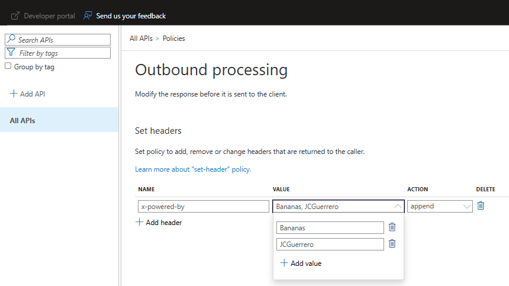

Which will create `append` the following headers to all output

```
<!--
    IMPORTANT:
    - Policy elements can appear only within the <inbound>, <outbound>, <backend> section elements.
    - Only the <forward-request> policy element can appear within the <backend> section element.
    - To apply a policy to the incoming request (before it is forwarded to the backend service), place a corresponding policy element within the <inbound> section element.
    - To apply a policy to the outgoing response (before it is sent back to the caller), place a corresponding policy element within the <outbound> section element.
    - To add a policy position the cursor at the desired insertion point and click on the round button associated with the policy.
    - To remove a policy, delete the corresponding policy statement from the policy document.
    - Policies are applied in the order of their appearance, from the top down.
-->
<policies>
    <inbound />
    <backend>
        <forward-request />
    </backend>
    <outbound>
        <set-header name="x-powered-by" exists-action="append">
            <value>Bananas</value>
            <value>{user-name}</value>
        </set-header>
    </outbound>
    <on-error />
</policies>
```

We'll validate this in a bit.

### Foundries

We'll add both Foundry instances as APIs in APIM.

1. APIs > APIs
2. Click on "Microsoft Foundry"

#### PTU

##### Select AI Service

1. Filter by "PTU"
2. Select the PTU instance

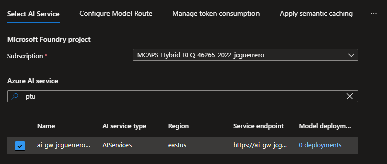

##### Configure Model Route

Use `foundry-ptu-openai` for all 3

- Display name:
- Name:
- Base path:

For **Options**, Leave "Azure OpenAI" selected.

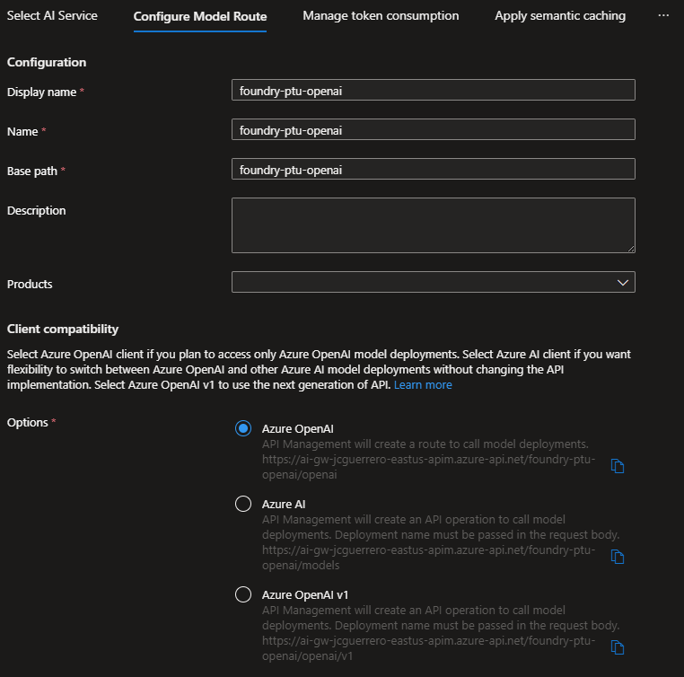

> [!NOTE]
> The `-openai` suffix is important.

##### Manage token consumption

We will manually do this section later. However, we want you to know where that data comes from.

Note 2 important details:

- Limit by: Subscription
- Token quota

Please select everything as in the photo.

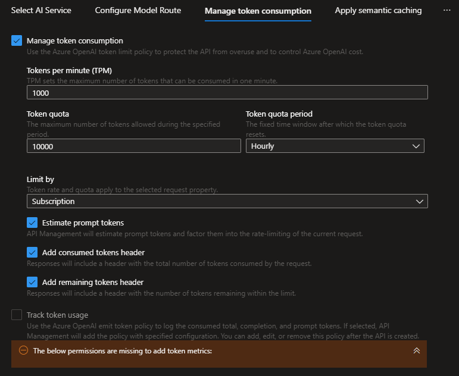

##### Apply semantic caching

Semantic caching is outside the scope of this tutorial. However, you can experiment yourself by creating a ReDIS cache and configuring it in APIM.

> [!WARNING]
> OpenAI sometimes would reply w/ status 200, and message "Something went wrong". This gets cached

##### Setup AI content safety

APIM allows to connect directly to a Content Safety instance.

However, since foundry includes Content Safety as part of its built-in APIs, we'll do that instead in a later step.

##### Review + create

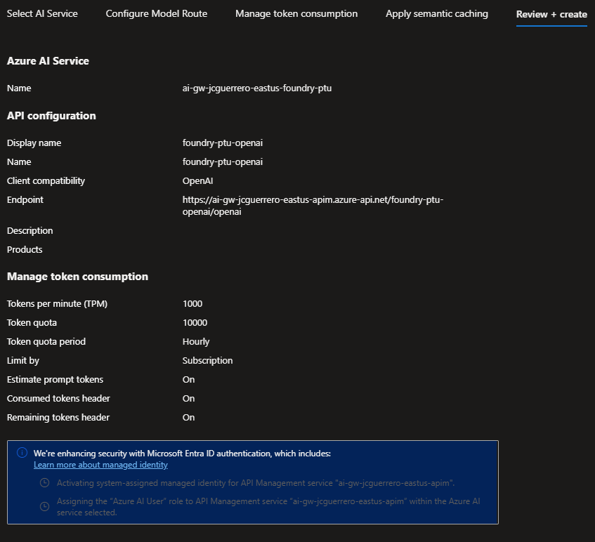

##### Design

See how APIM read the OpenAPI spec (not to be confused with OpenAI) for all the methods.

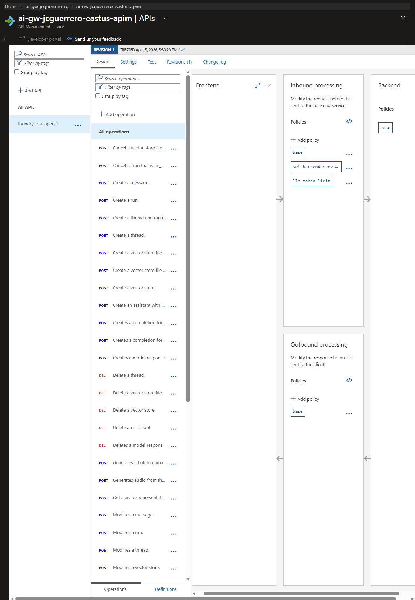

Note that in "Inbound processing" there is an XML symbol like this: `</>`. Click it

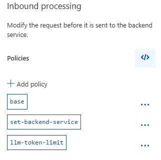

Inside, you'll see

```xml
<policies>
    <inbound>
        <base />

        <!-- APIM-to-service -->
        <set-backend-service id="apim-generated-policy" backend-id="foundry-ptu-openai-ai-endpoint" />

        <!-- Sets limit -->
        <llm-token-limit
          remaining-quota-tokens-header-name="remaining-tokens"
          remaining-tokens-header-name="remaining-tokens"
          tokens-per-minute="1000"
          token-quota="10000" token-quota-period="Hourly"
          counter-key="@(context.Subscription.Id)"
          estimate-prompt-tokens="true"
          tokens-consumed-header-name="consumed-tokens" />
    </inbound>
```

> [!IMPORTANT]
> Note this bit: `<set-backend-service id="apim-generated-policy" backend-id="foundry-ptu-openai-ai-endpoint" />`

> [!NOTE]
> `<base />` always goes on top!
> Its APIM's way to say "and enforce higher level policies (Product/Global)
> We'll cover that in a future module

##### Backends

1. Go to APIs > Backends. and find the backend with the ID `foundry-ptu-openai-ai-endpoint`. This is the backend service that the APIM policy is routing requests to.
1. Go to Authorization credentials > Managed Identity. Look at the following fields:

- Client identity: System managed identity
- Resource ID: `https://cognitiveservices.azure.com/`


##### Managed Identity

"System managed identity" huh? what is up w/ that?

Let's go to

1. APIM > Security > Managed identities
1. Click on [ Azure role assignments ]. NOTE: This is RBAC
1. Note that It got connected w/ "Azure AI User"

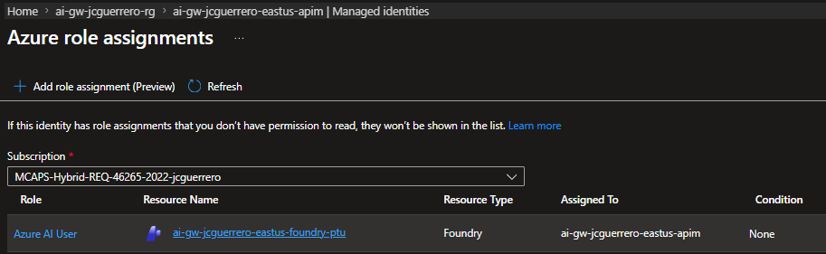

##### Settings

1. Go back to the APIs > APIs > `foundry-ptu-openai`.
1. Click on "Settings".

###### General

1. Note that the wizard kindly added `/openai` suffixes for the APIs.

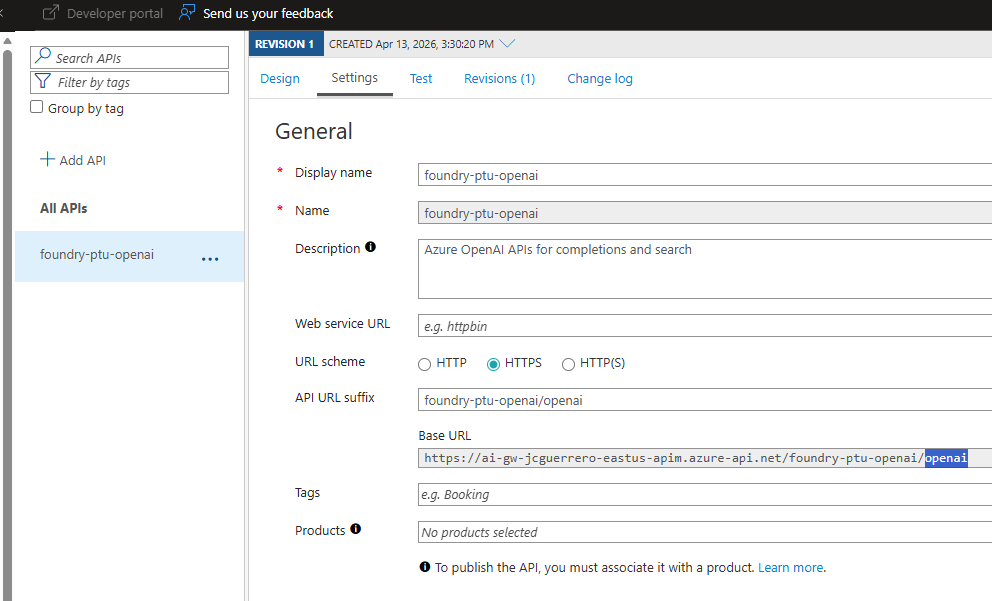

> [!NOTE]
> Remember that "NOTE: `-openai` suffix is important?"

###### Subscription

APIM by default, uses `Ocp-Apim-Subscription-Key`header for subscriptions (we'll get to them later)

However, note that here the values are:

- Header name: `api-key`
- Query parameter name: `subscription-key`

This simplifies passing the `API_KEY` from a `python` app, where we can replace the **Primary Key**, for a **Subscription Key**.

###### Diagnostic Logs

- [x] Enable
- Destination: `ai-gw-{stack-id}-eastus-appi`
- Additional settings > Advanced Options: as-is But is fun to know that you can log frontend/backend request/response
  - Frontend Request
  - Frontend Response
  - Backend Request
  - Backend Response

##### Test

We'll test w/ the following endpoint:

- "POST Creates a completion for the chat message"
  - Template parameters:
    - `deployment-id`: `gpt-4.1-mini-global-standard-latest`
    - `api-version`: `2025-01-01-preview`

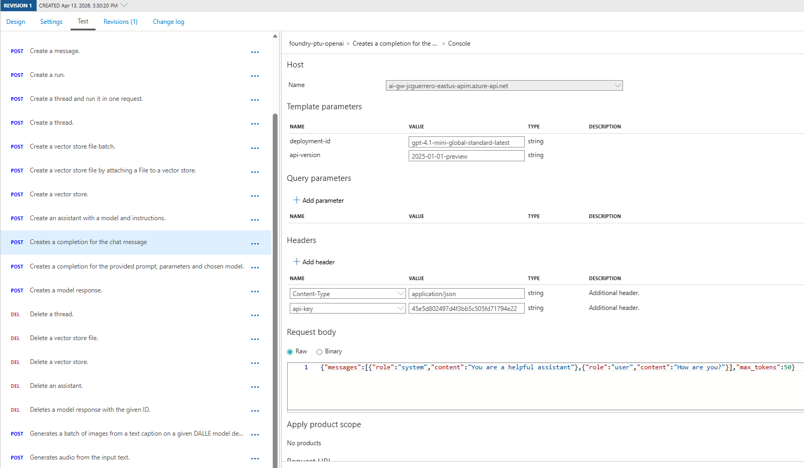

Replies w/ something like this

**HTTP Respose**

**Message**

(Headers)

```
x-content-type-options: nosniff
x-ms-client-request-id: Not-Set
x-ms-deployment-name: gpt-4.1-mini-global-standard-stable
x-ms-region: East US
x-ratelimit-limit-requests: 100
x-ratelimit-limit-tokens: 100000
x-ratelimit-remaining-requests: 99
x-ratelimit-remaining-tokens: 99995
x-powered-by: Bananas,JCGuerrero <<< Look mom! I'm famous
```

(Body)

```json
{
  "choices": [
    {
      "content_filter_results": {
        "hate": {
          "filtered": false,
          "severity": "safe"
        },
        "protected_material_code": {
          "filtered": false,
          "detected": false
        },
        "protected_material_text": {
          "filtered": false,
          "detected": false
        },
        "self_harm": {
          "filtered": false,
          "severity": "safe"
        },
        "sexual": {
          "filtered": false,
          "severity": "safe"
        },
        "violence": {
          "filtered": false,
          "severity": "safe"
        }
      },
      "finish_reason": "stop",
      "index": 0,
      "logprobs": null,
      "message": {
        "annotations": [],
        "content": "I'm doing well, thank you! How can I assist you today?",
        "refusal": null,
        "role": "assistant"
      }
    }
  ],
  "created": 1776185964,
  "id": "chatcmpl-DUbOeGtdzUYiVCXIhCNOIAu2LOGPd",
  "model": "gpt-4.1-mini-2025-04-14",
  "object": "chat.completion",
  "prompt_filter_results": [
    {
      "prompt_index": 0,
      "content_filter_results": {
        "hate": {
          "filtered": false,
          "severity": "safe"
        },
        "jailbreak": {
          "filtered": false,
          "detected": false
        },
        "self_harm": {
          "filtered": false,
          "severity": "safe"
        },
        "sexual": {
          "filtered": false,
          "severity": "safe"
        },
        "violence": {
          "filtered": false,
          "severity": "safe"
        }
      }
    }
  ],
  "service_tier": "default",
  "system_fingerprint": "fp_b6f445fc1c",
  "usage": {
    "completion_tokens": 15,
    "completion_tokens_details": {
      "accepted_prediction_tokens": 0,
      "audio_tokens": 0,
      "reasoning_tokens": 0,
      "rejected_prediction_tokens": 0
    },
    "prompt_tokens": 20,
    "prompt_tokens_details": {
      "audio_tokens": 0,
      "cached_tokens": 0
    },
    "total_tokens": 35
  }
}
```

#### PayG

We'll follow the same process from PTU, but this time

- Name: `foundry-payg-openai`

##### Managed identities

Verify that the managed identity has the "Azure AI User" role assigned.

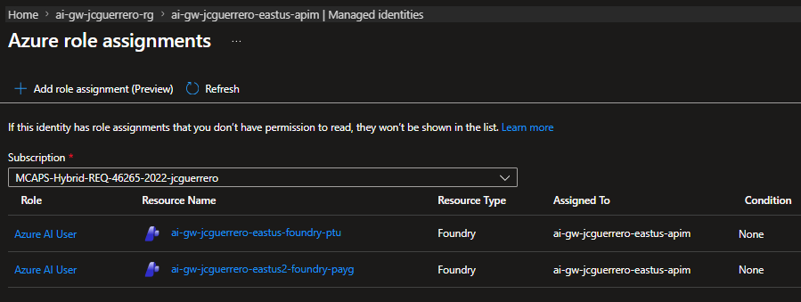

## Next

[Back to Module](./README.md)
