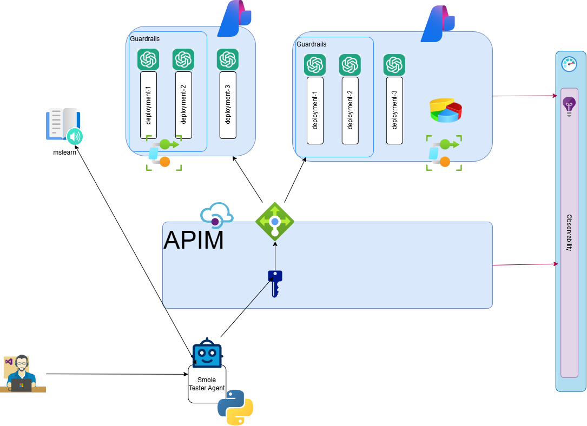

# Module 4: APIM Load Balancing + App Insights

## Summary

Add a load balancer across PTU and PAYG backends with circuit breaker failover, and use App Insights to observe the routing behavior.

## Motivation

In production, you want to maximize utilization of pre-paid (PTU) capacity while falling back to pay-as-you-go (PAYG) when PTU is overwhelmed. Observability lets you verify and debug this routing.

## Use cases

- Priority-based routing: PTU first, PAYG as fallback
- Circuit breaker for `429 Too Many Requests` protection
- End-to-end request tracing through App Insights
- KQL queries to correlate frontend requests with backend routing decisions

## Skills you will learn

- Creating APIM load balancer pools with priority-based backends
- Configuring circuit breaker rules (failure count, trip duration, Retry-After)
- Cloning APIs and pointing them to load balancer pools
- Using App Insights: Search, Live metrics, and KQL log queries
- Correlating `requests` and `dependencies` tables in KQL

## Chapters

1. APIM
   1. [Load balancing](./apim/load_balance.md)
   1. [App Insights](./appi.md)

## Goal

## Next

[Back to Modules](../README.md)
