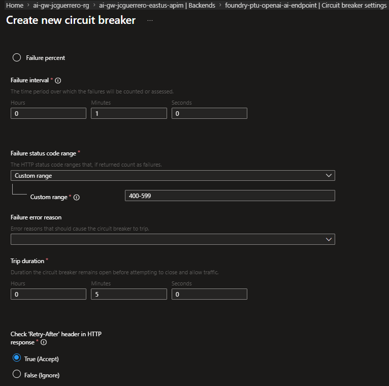

# APIM Load balancing

In APIM, we can quickly create load balancer for APIs fronted with APIM.

In this case,

- We'll pretend that `foundry-ptu` is where we have paid-token-usage for all deployment models.
- And `foundry-payg` is where we have pay-as-you-go usage for all deployment models.

We want to create a load balancer that prioritizes `foundry-ptu`, but falls back on `foundry-payg` if the `foundry-ptu` backend is unavailable or the subscription type is pay-as-you-go.

## Load balancer pool

1. APIM > APIs > Backends
1. [ Load balancer ] tab
1. [ + Create new pool ]

- Name: `foundry-openai-lb`
- Add backends to pool: Select
- Backend weight and priority:
  - `-ptu-`: Priority: 1
  - `-payg-`: Priority: 2

> [!NOTE]
> Weight allows to do things like 50/50 traffic splitting between backends.

Great! Now we have a pool. But how will APIM "know" when `-ptu-` is unhealthy enough to switch to `-payg-`?

## Circuit breaker

1. APIM > APIs > Backends
1. [ Backends ] tab
1. Select `-ptu-`
1. Settings > Circuit breaker settings > [ Add new ]

- **Rule name**: TooManyRequests
- **Failure count**: `3`
- **Failure interval**:
  - Minutes:`1`
- **Custom range**: `429` (Too many requests)
- **Trip duration**:
  - Minutes:`5`
- **Check 'Retry-After header in HTTP response**: True (Accept)



Oah! What was all that? Nothing much, basically:

> "If when I try getting a chat-completion from `-ptu-`
>
> I get 3 `429 Too Many Requests` responses within 1 minute,
>
> APIM will consider the `-ptu-` backend unhealthy and will route traffic to the `-payg-` backend for the next 5 minutes. It will also respect the `Retry-After` header if present."

These values are NOT meant to be definitive. Make sure you monitor and adjust them based on your actual traffic patterns and backend performance.

> [!WARNING]
> APIM currently supports only 1 circuit breaker rule!

## API

We have almost everything we need to create an API that uses our load balancer. The last step is to create an API that points to the load balancer pool instead of a single backend.

1. APIM > APIs > APIs
1. `foundry-ptu-openai` > [ ... ] > Clone
1. Rename cloned API to `foundry-openai-lb`

### Design

### Inbound processing

Update the `set-backend-service` to point to `foundry-openai-lb` instead:

```xml
<set-backend-service id="apim-generated-policy" backend-id="foundry-openai-lb" />
```

### Settings

Update the values to the following:

- Settings: `foundry-openai-lb`
- API URL suffix: `foundry-openai-lb/openai`

## Test

Same as before, we can test directly from the portal.

### APIM

```json
{
  "choices": [
    {
      "content_filter_results": {
        "hate": {
          "filtered": false,
          "severity": "safe"
        },
        "protected_material_code": {
          "filtered": false,
          "detected": false
        },
        "protected_material_text": {
          "filtered": false,
          "detected": false
        },
        "self_harm": {
          "filtered": false,
          "severity": "safe"
        },
        "sexual": {
          "filtered": false,
          "severity": "safe"
        },
        "violence": {
          "filtered": false,
          "severity": "safe"
        }
      },
      "finish_reason": "stop",
      "index": 0,
      "logprobs": null,
      "message": {
        "annotations": [],
        "content": "I'm doing great, thank you! How can I assist you today?",
        "refusal": null,
        "role": "assistant"
      }
    }
  ],
  "created": 1776189033,
  "id": "chatcmpl-DUcC9yXxuUwbBkBJzMRisoJriJgRf",
  "model": "gpt-4.1-mini-2025-04-14",
  "object": "chat.completion",
  "prompt_filter_results": [
    {
      "prompt_index": 0,
      "content_filter_results": {
        "hate": {
          "filtered": false,
          "severity": "safe"
        },
        "jailbreak": {
          "filtered": false,
          "detected": false
        },
        "self_harm": {
          "filtered": false,
          "severity": "safe"
        },
        "sexual": {
          "filtered": false,
          "severity": "safe"
        },
        "violence": {
          "filtered": false,
          "severity": "safe"
        }
      }
    }
  ],
  "service_tier": "default",
  "system_fingerprint": "fp_b6f445fc1c",
  "usage": {
    "completion_tokens": 15,
    "completion_tokens_details": {
      "accepted_prediction_tokens": 0,
      "audio_tokens": 0,
      "reasoning_tokens": 0,
      "rejected_prediction_tokens": 0
    },
    "prompt_tokens": 20,
    "prompt_tokens_details": {
      "audio_tokens": 0,
      "cached_tokens": 0
    },
    "total_tokens": 35
  }
}
```

### python

And also using our `python` client.

```
# openai via APIM
AZURE_OPENAI__ENDPOINT="https://ai-gw-{stack-id}-eastus-apim.azure-api.net/foundry-openai-lb/openai/deployments/FIXME/chat/completions?api-version=FIXME"
AZURE_OPENAI__API_KEY="{Subscription Primary key}"
AZURE_OPENAI__DEPLOYMENT="gpt-4.1-mini-global-standard-latest"
```

> [!IMPORTANT]
> Yes, the deployment name appears in **both** `ENDPOINT` and `DEPLOYMENT`. The Agent Framework SDK requires the full URL path _and_ the deployment name separately. Replace both `FIXME` placeholders in the URL with the actual deployment name and API version (e.g. `2025-01-01-preview`).

4. Run the `my_agent` app: `python src/my_agent`

```
User: What tools are available to you?
Agent: I have access to tools in the Microsoft functions namespace:

1. microsoft_docs_search: Search official Microsoft/Azure documentation for relevant content.
2. microsoft_code_sample_search: Search official Microsoft documentation for code snippets and examples.
3. microsoft_docs_fetch: Fetch and convert a specific Microsoft documentation webpage to markdown format for detailed information.

I use these tools to provide accurate and up-to-date information from Microsoft sources. How can I assist you today?
```

## Next

[Back to Module](../README.md)
