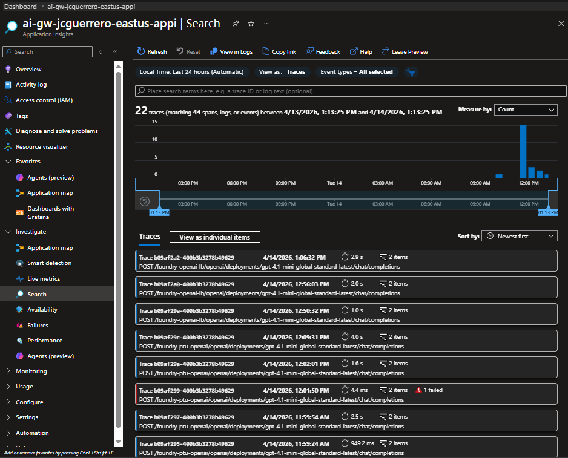
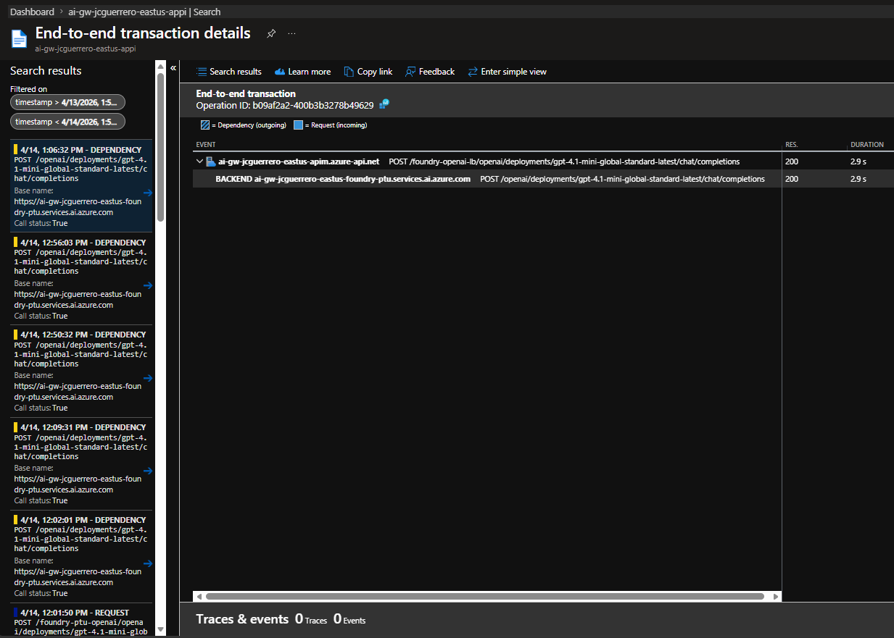
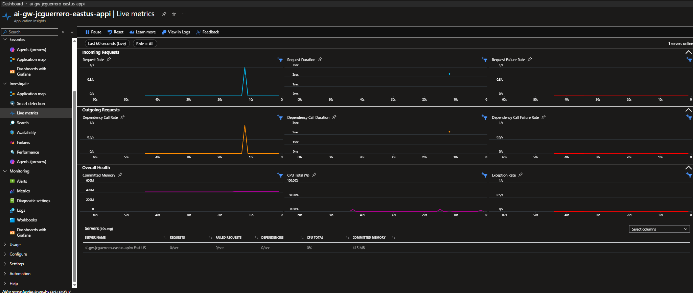
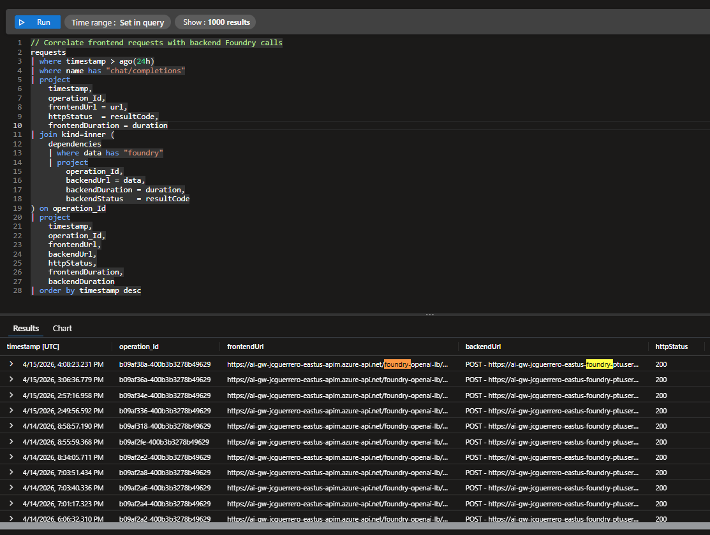
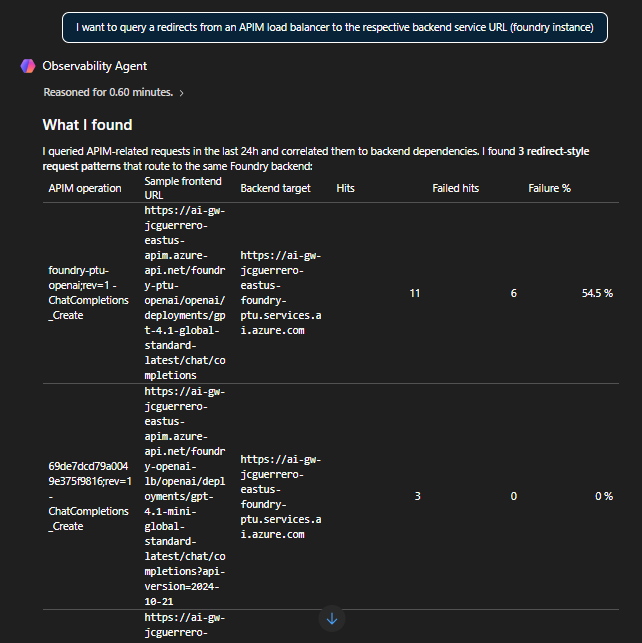

# App Insights

In previous modules, we've seen token usage stats inside foundry.

In this section, we will explore how to use Azure Application Insights to monitor and analyze the logs generated by our AI Gateway.

This will help us gain deeper insights into the performance and usage of our deployed models.

## Investigate

### Search

1. App Insights > Investigate > Search
1. Click on "Last 24 hours"

In a single place, you can see all the logs from all components connected to App Insights.



3. Click on one of the transactions to view its details.



We can see how `foundry-openai-lb` forwarded to `-ptu`

### Live metrics

1. App Insights > Investigate > Live metrics.
1. Wait for the "app" to connect.
1. Wait until you see a flat line.
1. Use your `python` client a couple of times.



## Monitoring

### Logs

For an in depth tutorial on KQL, see [Tutorial: Use Log Analytics](https://learn.microsoft.com/en-us/azure/azure-monitor/logs/log-analytics-tutorial)

> [!NOTE]
> APIM sends telemetry to App Insights in two tables:
>
> - `requests`: Frontend (client → APIM) entries
> - `dependencies`: Backend (APIM → Foundry) entries
>
> To see load balancer routing, we query `dependencies` for backend calls that contain the foundry backend URL.

#### Load balancing routing (KQL)

1. App Insights > Monitoring > Logs
1. Paste the following KQL query:

```kql
// Correlate frontend requests with backend Foundry calls
requests
| where timestamp > ago(24h)
| where name has "chat/completions"
| project
    timestamp,
    operation_Id,
    frontendUrl = url,
    httpStatus  = resultCode,
    frontendDuration = duration
| join kind=inner (
    dependencies
    | where data has "foundry"
    | project
        operation_Id,
        backendUrl = data,
        backendDuration = duration,
        backendStatus   = resultCode
) on operation_Id
| project
    timestamp,
    operation_Id,
    frontendUrl,
    backendUrl,
    httpStatus,
    frontendDuration,
    backendDuration
| order by timestamp desc
```

This joins frontend requests with their backend dependency calls, so you can see the full client → APIM → Foundry flow. The `backendUrl` column shows whether traffic went to `-ptu` or `-payg`.



#### Observability agent

Alternatively, you can use the Observability agent:

1. App Insights > Monitoring > Logs > [ Observability agent ]
1. Query something like

> "I want to query redirects from an APIM load balancer to the respective backend service URL (foundry instance)"



## Next

[Back to Module](./README.md)
