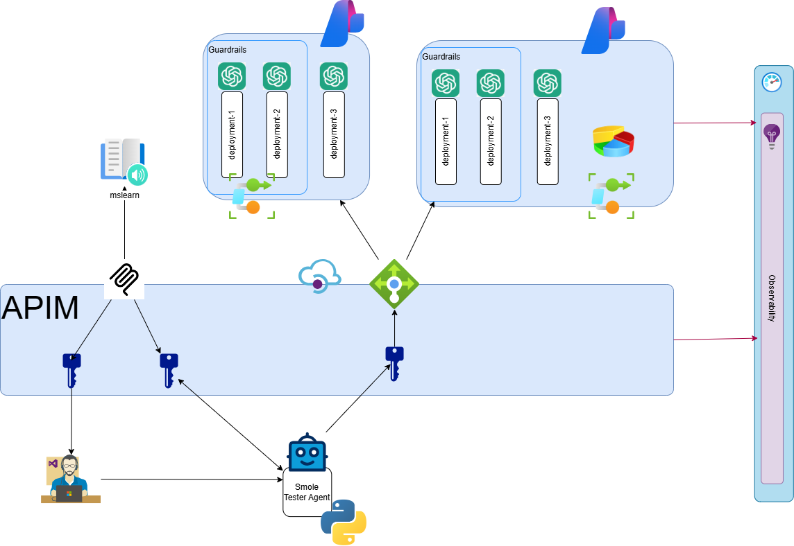

# Module 5: MCP Servers in APIM

## Summary

Expose an existing MCP server (MS Learn) through APIM, secure it with a subscription key, and integrate it with VS Code Copilot.

## Motivation

MCP servers give AI agents access to external tools. By fronting them with APIM, you get the same governance (subscriptions, policies, monitoring) that you already have for your LLM APIs.

## Use cases

- Securing MCP tool access behind subscription keys
- Integrating APIM-hosted MCP servers with VS Code Copilot chat
- Governing AI agent tool usage with the same policies as LLM calls

## Skills learned

- Exposing an existing MCP server in APIM
- Requiring subscription keys for MCP endpoints
- Configuring `.vscode/mcp.json` with HTTP headers for authentication
- Smoke testing MCP tools from a Python agent client

## Chapters

1. APIM
   1. [MCP via APIM](./apim/mcp.md)
   1. [Python Smoke testing](./python.md)

## Goal

## Next

[Back to Modules](../README.md)
