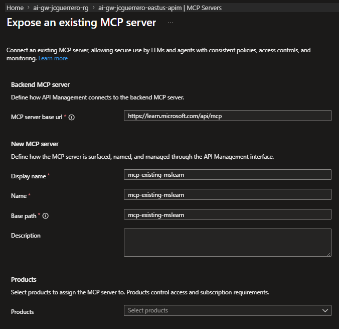
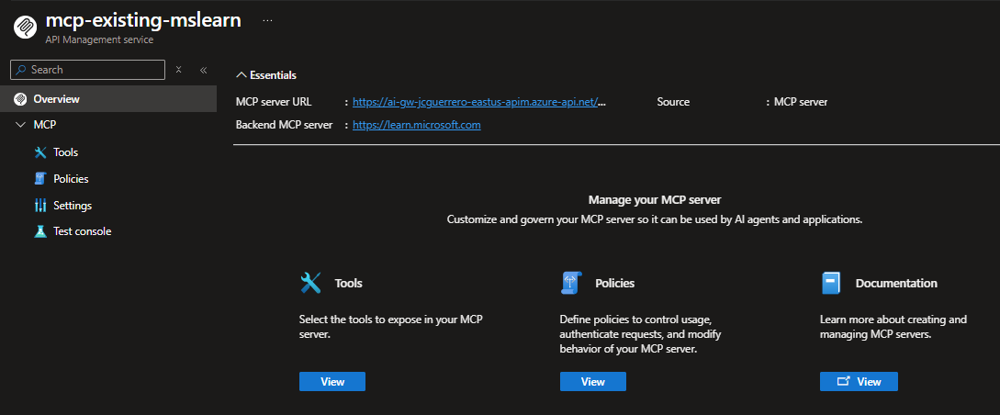
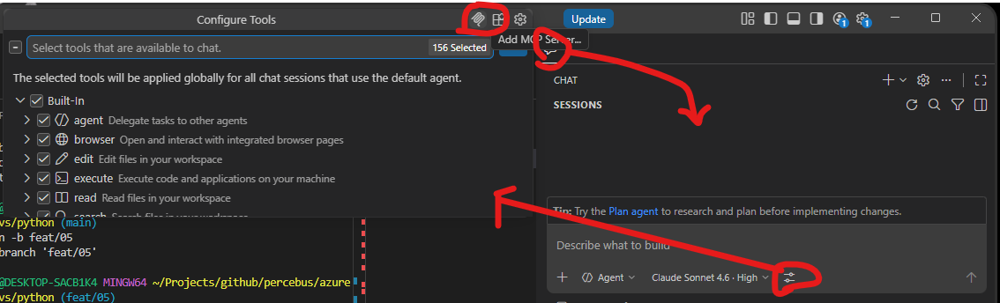
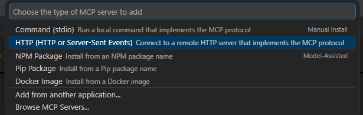
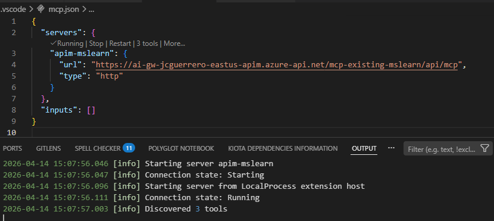
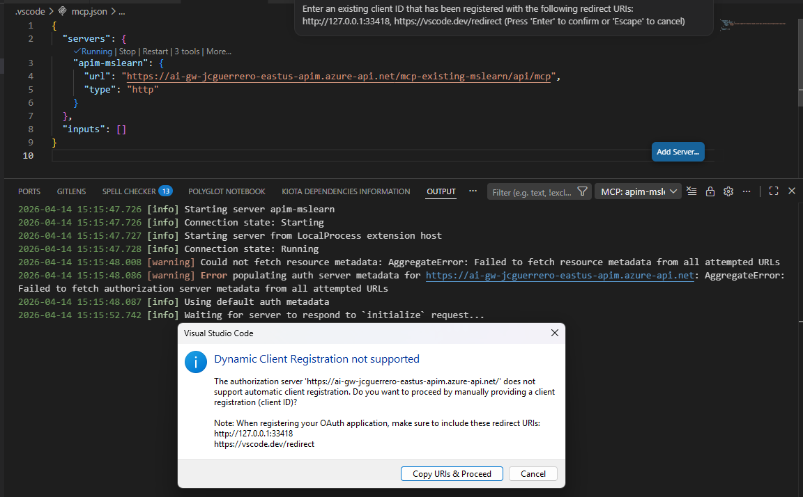

# Bring-your-own-MCPs

We'll add the MS learn MCP server via APIM

## Expose an existing MCP server

1. APIM > APIs > MCP Servers
1. [ + Create MCP Server v ] > Expose an existing MCP server

- **MCP server base url**: `https://learn.microsoft.com/api/mcp`
- Add to `mcp-existing-mslearn` to:
  - Display name
  - Name
  - Base path



> [!NOTE]
> "Expose an API As an MCP Server" allows you to add an existing OpenAPI service (i.e. `api/employees`) and convert each of its methods into MCP endpoints (`POST` > `create_employee`, `GET` > `get_employees`, etc.)

## Overview

Note the following:

- The MCP server: `https://ai-gw-{stack-id}-eastus-apim.azure-api.net/mcp-existing-mslearn/api/mcp`.



## Visual Studio Code Integration

1. AI Chat > Configure tools > MCP logo > HTTP
1. Add the same URL as above





It should [create a `.vscode/mcp.json` file](../../../../.vscode/mcp.json) with the following content:

```json
{
  "servers": {
    "apim-mslearn": {
      "url": "https://ai-gw-{stack-id}-eastus-apim.azure-api.net/mcp-existing-mslearn/api/mcp",
      "type": "http"
    }
  },
  "inputs": []
}
```



> [!WARNING]
> Does that mean anybody can use the MCP server via my APIM instance?

YES! Let's add a **Subscription key** requirement.

## Subscription key Requirement

For this section, we will be following the steps from this other tutorial: [Secure access to MCP servers in API Management](https://learn.microsoft.com/en-us/azure/api-management/secure-mcp-servers)

1. APIM > APIs > MCP servers
1. Click on `mcp-existing-mslearn`
1. [ MCP v ] > Settings

- [x] Subscription required
  - **Header name**: `Ocp-Apim-Subscription-Key` (as-is)
  - **Query name**: Leave empty.

4. Wait 10 Mississippis (APIM sometime takes a few seconds to apply the changes).
1. Restart MCP in the `.vscode/mcp.json` file.
1. You should see a similar error: 
1. Remember that subscription from [python/.env](../../../../python/.env.example) ? Copy it to `.vscode/mcp.json` under the `servers` section for the `apim-mslearn` server:

```json
{
  "servers": {
    "apim-mslearn": {
      "url": "https://ai-gw-{stack-id}-eastus-apim.azure-api.net/mcp-existing-mslearn/api/mcp",
      "type": "http",
      "headers": {
        "Ocp-Apim-Subscription-Key": "<your-subscription-key>"
      }
    }
  },
  "inputs": []
}
```

8. Now it should work without the error, as the subscription key is included in the request headers.
