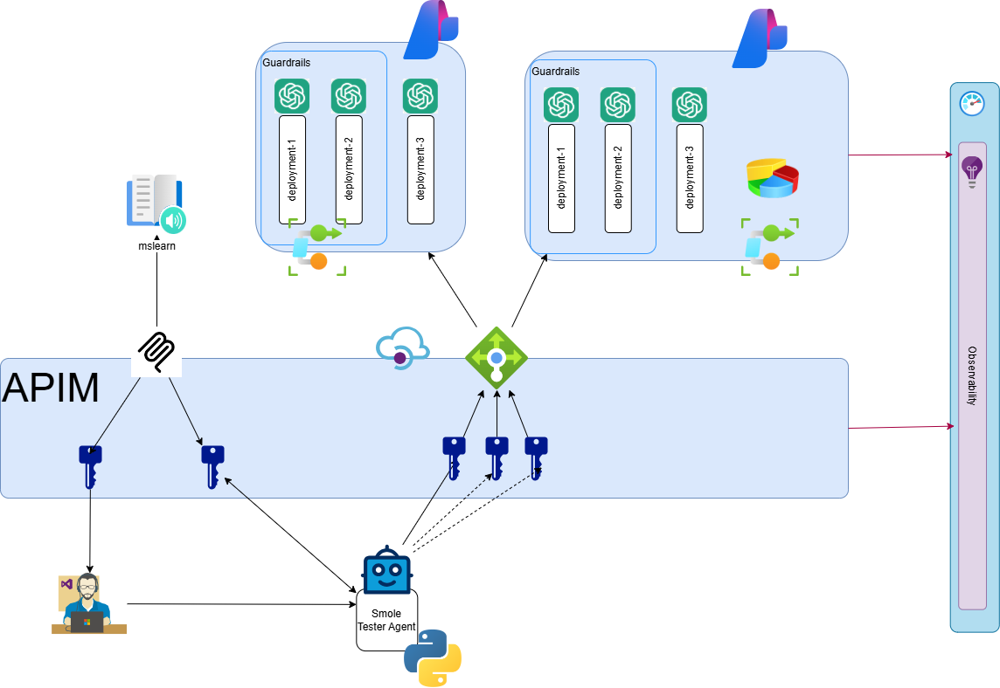

# Module 6: APIM Users, Products, Subscriptions & Policy Fragments

## Summary

Organize APIs into products with distinct policies, create users and subscriptions, and build reusable policy fragments for rate limiting.

## Motivation

Different teams and applications need different quotas and access levels. Instead of duplicating APIs with different policies, APIM Products let you group APIs and manage access through subscriptions. Policy Fragments let you define reusable policy logic once and apply it across multiple APIs.

## Use cases

- Rate-limiting MCP calls to 3 per minute per subscription
- Suspending and reactivating access without touching the API itself
- Rotating subscription keys after an accidental leak

## Skills learned

- Creating APIM Products and assigning APIs to them
- Managing Users and Subscriptions (create, suspend, activate, rotate keys)
- Building reusable Policy Fragments (e.g. `rate-limit`)
- Understanding policy scopes: Global > Product > API > Operation
- Discovering scope limitations: why `llm-token-limit` can't go in policy fragments or products

## Chapters

1. APIM
   1. [Products](./apim/products.md)
   1. [Subscriptions](./apim/subscriptions.md)
   1. [Policy Fragments](./apim/policy_fragment.md)

## Goal

## Next

[Back to Modules](../README.md)
