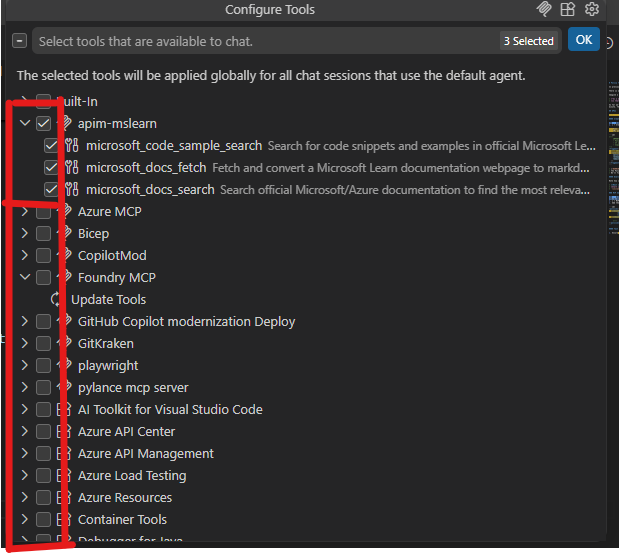
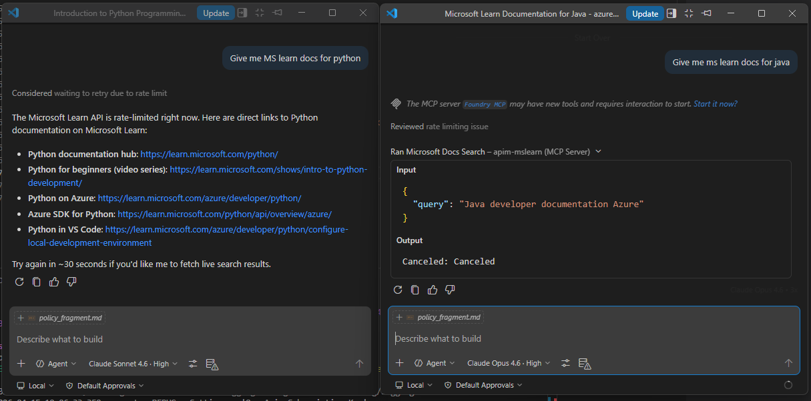

# Re-using policy fragments

In previous steps we learned how to group APIs by policies into products

There is another way to create reusable policy logic called **policy fragments**.

Imagine a feature request:

> _"As a manager, I want to limit MCP calls to 3 per minute per user/system,_
> _so that they do not overwhelm the backend system."_

So far we've limited token usage for AI, but now we want to limit the number of API calls per application per minute. This is where policy fragments come in handy.

## APIs

### Policy fragments

For more information, visit [Reuse policy configurations in your API Management policy definitions](https://learn.microsoft.com/en-us/azure/api-management/policy-fragments)

#### rate-limit

##### Create

1. APIM > APIs > Policy fragments
1. [ + Create ]

- Name: `subscription_rate-limit_60s_3x`
- XML policy fragment:

```xml
<!--
    IMPORTANT:
    - Policy fragment are included as-is whenever they are referenced.
    - If using variables. Ensure they are setup before use.
    - Copy and paste your code here or simply start coding
-->
<fragment>
  <!-- SRC: https://learn.microsoft.com/en-us/azure/api-management/rate-limit-policy -->
  <rate-limit
    calls="1"
    renewal-period="60"
    remaining-calls-variable-name="remainingCallsPerSubscription"
  />
</fragment>
```

> [!IMPORTANT]
> Remember, some policies can only be inbound, and some can only be outbound.

> [!CAUTION]
> The Policy contains 1 call per 60 seconds.
> We'll fix it later

##### Overview

Note how it says

> **Next steps**
> _Start using policy fragments in your policy documents._
> `<include-fragment fragment-id="subscription_rate-limit_60s_3x" />`

##### MCP Servers

1. APIM > APIs > MCP Servers
1. Go to `mcp-existing-mslearn`
1. [ > MCP ] > Policies
1. Add the following in inbound

```xml
<policies>
  <inbound>
    <base />
    <include-fragment fragment-id="subscription_rate-limit_60s_3x" />
  </inbound>

  <!-- ... -->
</policies>
```

##### Test the policy fragment in VS Code

1. Ensure only the `apim-mslearn` MCP is enabled



2. Open 2 side-by-side Copilot chat windows
1. In each window, make API calls to the `mcp-existing-mslearn` API and observe the rate limiting behavior.

- Give me mslearn docs for python
- Give me mslearn docs for Java



If you go to the `OUTPUT` tab, you should see

```
2026-04-15 10:33:53.038 [info] Connection state: Starting
2026-04-15 10:33:53.038 [info] Starting server from LocalProcess extension host
2026-04-15 10:33:53.038 [info] Connection state: Running
2026-04-15 10:33:53.522 [info] Connection state: Error 429 status sending message to https://ai-gw-{stack-id}-eastus-apim.azure-api.net/mcp-existing-mslearn/api/mcp: { "statusCode": 429, "message": "Rate limit is exceeded. Try again in 60 seconds." }
```

> [!CAUTION]
> Error 429 status sending message to https://ai-gw-{stack-id}-eastus-apim.azure-api.net/mcp-existing-mslearn/api/mcp:
> `{ "statusCode": 429, "message": "Rate limit is exceeded. Try again in 60 seconds." }`

#### Fix the policy

1. Update the policy fragment to allow ~~1~~ **3** calls per 60 seconds:

```xml
<fragment>
  <!-- SRC: https://learn.microsoft.com/en-us/azure/api-management/rate-limit-policy -->
  <rate-limit
    calls="3" <<< FIX
    renewal-period="60"
    remaining-calls-variable-name="remainingCallsPerSubscription"
  />
</fragment>
```

> [!TIP]
> If you had this policy attached to 100 APIs, you would update the policy fragment once and it would automatically apply to all 100 APIs.

#### llm-token-limit

Oh sweet, so we can also move the `llm-token-limit` to a policy fragment, right?

Try it:

1. APIM > APIs > Policy fragments

- Name: `subscription_llm-token-limit_1Kpm_10Kph`
- XML policy fragment:

```xml
<llm-token-limit
  remaining-quota-tokens-header-name="remaining-tokens"
  remaining-tokens-header-name="remaining-tokens"
  tokens-per-minute="1000"
  token-quota="10000" token-quota-period="Hourly"
  counter-key="@(context.Subscription.Id)"
  estimate-prompt-tokens="true"
  tokens-consumed-header-name="consumed-tokens" />
```

But you get

> [!CAUTION]
> Error in element 'llm-token-limit' on line 8, column 6:
> The 'remaining-quota-tokens-header-name' attribute is unavailable for websocket APIs and global/product policies.

What this is saying is basically that Policy fragments have to be Universal for ALL protocols, not JUST HTTP(S).

Since this is an HTTP specific, it cannot be used in a policy fragment that is intended to be universal across all protocols.

Alas, a Product is our only option
