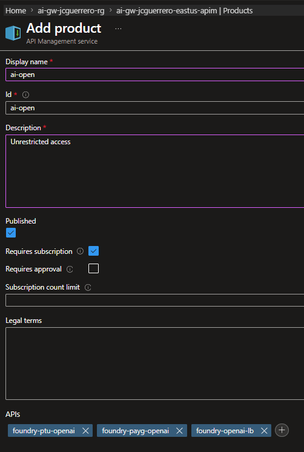
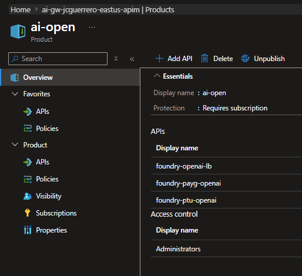
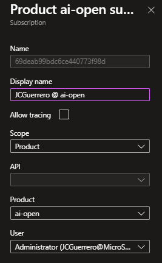
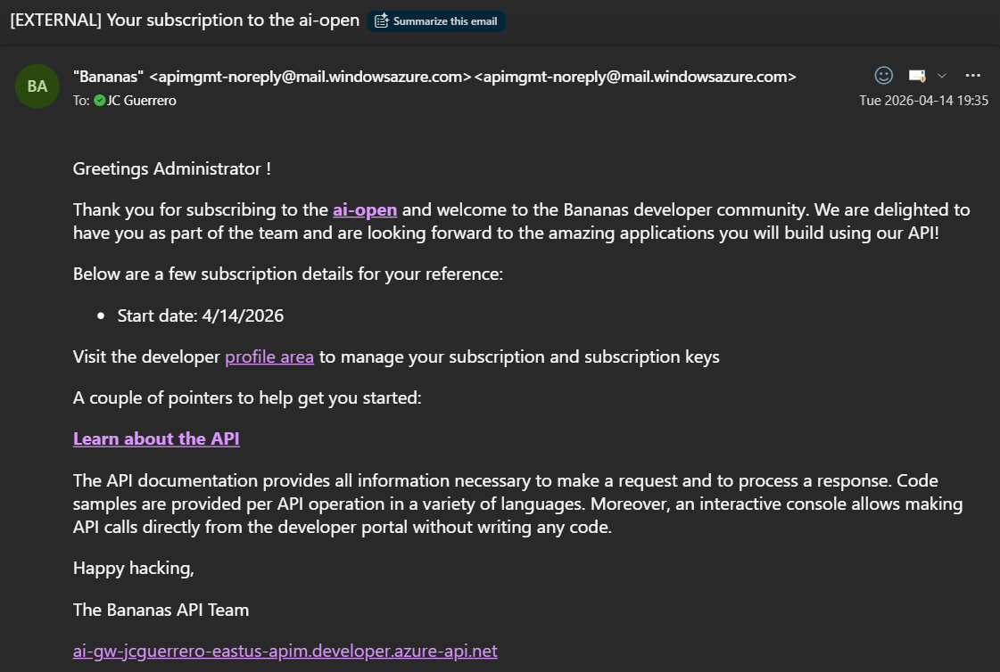
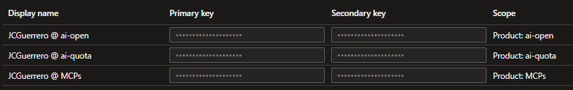

# Grouping APIs

APIM includes a notion called "Products", which is basically a collection of APIs with associated policies and subscription requirements. By grouping APIs into products, we can apply policies at the product level and manage access through subscriptions, simplifying the management of different quotas and access levels for different teams.

For more information, see [Tutorial: Create and publish a product](https://learn.microsoft.com/en-us/azure/api-management/api-management-howto-add-products?tabs=azure-portal&pivots=interactive)

## Products

### ai-open

#### Add

1. APIM > APIs > Products
1. [ + Add ]

- Display name: `ai-open`
- Id: `ai-open`
- Description: Open access
- [x] Published
- [x] Requires subscription
- APIs:
  - `foundry-ptu-openai`
  - `foundry-payg-openai`
  - `foundry-openai-lb`

#### Overview

#### Subscriptions

1. [ + Add subscribers ]
1. Select the Admin (your self)
1. Click on the subscription you just added to view its details.
1. Rename the "Display name" of the subscription to `{username} @ ai-open`

##### eMail

You should receive an email notification for the subscription you just added.

#### Subscriptions

1. [ + Add subscribers ]
1. Select the Admin (your self)

### MCPs

#### Add

Wait, what about the MCPs?

Right, let's also create a product for the MCP(s).

- Display Name: `MCPs`
- Id: `mcp`
- Description: `All MCPs`
- [x] Published: Checked
- [x] Requires subscription: Checked
- APIs
  - `mcp-existing-mslearn`

## Subscriptions

Now you should have

- A key for AI
- A key for MCPs

Wait, two keys?

Yes, one for the AI product and one for the MCPs product. Each product has its own subscription key, which allows you to manage access and quotas independently.

## Next

[Back to Module](../README.md)
