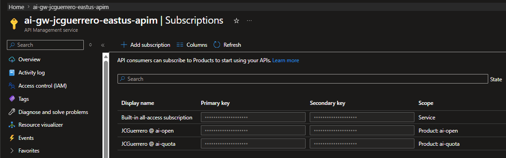

# APIM Policy fragments

Remember the Token Limit quota policy we added to Both APIs? Imagine a business requirement like this

1. We want to give team A 10M tokens per day. But team B only 1M tokens per day.
1. We want team C to have no quota.

That can quickly turn into a complex set of APIs just for the sake of the policies.

Luckily, we don't have to resort to that. APIM includes a notion called "Products", which is basically a collection of APIs with associated policies and subscription requirements. By grouping APIs into products, we can apply policies at the product level and manage access through subscriptions, simplifying the management of different quotas and access levels for different teams.

For more information, see [Tutorial: Create and publish a product](https://learn.microsoft.com/en-us/azure/api-management/api-management-howto-add-products?tabs=azure-portal&pivots=interactive)

## Products

### ai-open

#### Add

1. APIM > APIs > Products
1. [ + Add ]

  - Display name: `ai-open`
  - Id: `ai-open`
  - Description: Open access
  - [x] Published <<< VERY IMPORTANT!
  - [x] Requires subscription
  - APIs:
    - `foundry-ptu-openai`
    - `foundry-payg-openai`
    - `foundry-openai-lb`


#### Overview


#### Subscriptions

1. [ + Add subscribers ]
1. Select the Admin (your self)
1. Click on the subscription you just added to view its details.
1. Rename the "Display name" of the subscription to `{username} @ ai-open`


### ai-quota

Remember that policy to apply a quota limit?

```xml
<!-- Sets limit -->
<llm-token-limit
  remaining-quota-tokens-header-name="remaining-tokens"
  remaining-tokens-header-name="remaining-tokens"
  tokens-per-minute="1000"
  token-quota="10000" token-quota-period="Hourly"
  counter-key="@(context.Subscription.Id)"
  estimate-prompt-tokens="true"
  tokens-consumed-header-name="consumed-tokens" />
```

We'll follow the same steps above, then

1. Click on the product
2. v Product  > Policies

Apply the same policy, resulting in the following XML:

```xml
<!--
    - Policies are applied in the order they appear.
    - Position <base/> inside a section to inherit policies from the outer scope.
    - Comments within policies are not preserved.
-->
<!-- Add policies as children to the <inbound>, <outbound>, <backend>, and <on-error> elements -->
<policies>
    <!-- Throttle, authorize, validate, cache, or transform the requests -->
    <inbound>
        <base />
        <!-- Sets limit -->
        <llm-token-limit
          remaining-quota-tokens-header-name="remaining-tokens"
          remaining-tokens-header-name="remaining-tokens"
          tokens-per-minute="1000"
          token-quota="10000" token-quota-period="Hourly"
          counter-key="@(context.Subscription.Id)"
          estimate-prompt-tokens="true"
          tokens-consumed-header-name="consumed-tokens" />
    </inbound>
    <!-- Control if and how the requests are forwarded to services  -->
    <backend>
        <base />
    </backend>
    <!-- Customize the responses -->
    <outbound>
        <base />
    </outbound>
    <!-- Handle exceptions and customize error responses  -->
    <on-error>
        <base />
    </on-error>
</policies>
```

Now, we can remove that `<llm-token-limit>` policy from the individual APIs, since it's now applied at the product level.

#### Subscriptions

1. [ + Add subscribers ]
1. Select the Admin (your self)

### ai-quota-premium

Bonus excercise: Create another product called `ai-quota-premium` with a higher token quota, for example 10M tokens per day, and apply the same `<llm-token-limit>` policy with the updated quota values.

## Subscriptions

The list should look something like this:



## Testing

Now you can use the new subscription keys and test getting throttled by the quota limits.
