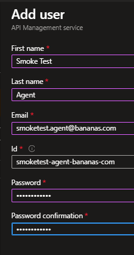
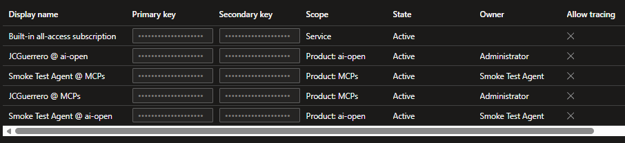

# APIM Users and Subscription

In the previous steps, you've created your own subscription keys to test the APIs and observe the quota limits in action.

But what if you want to deploy the `python` app to a web app? Then you should create a specific user for the app and generate a subscription key for that user. This way, the app can use its own subscription key to access the APIs without relying on your personal subscription key.

For more information, see [How to manage user accounts in Azure API Management](https://learn.microsoft.com/en-us/azure/api-management/api-management-howto-create-or-invite-developers)

## DISCLAIMER

> [!WARNING]
> In Microsoft, we're striving for a secret-less approach to manage access, which means reducing the reliance on static API keys and instead using more secure and manageable methods like Azure Managed Identities and OAuth tokens.
> Subscription keys should NEVER be used as the only layer of security.

They should be used ONLY to inform APIM which product the request is associated with, and not as a primary means of authentication or authorization.

It's useful to think of them as kafka consumer group Ids, which sit on Top of w/e security mechanisms you have in place, including

- VNets, subnets, private endpoints, etc
- Azure Managed Identities
- OAuth tokens
- JWToken authorization
- etc.

## Developer portal

### Users

> [!NOTE]
> Even though we're creating a user in the "Developer portal" section, it applies to ALL APIM

#### Smoke Test Agent

1. APIM > Developer portal > Users
1. [ + Add ]

- First name: `Smoke Test`
- Last name: `Agent`
- Email: `smoketest@bananas.com` <<< NOTE!
- Password: Something like `ChangeMe!123`



> [!NOTE]
> APIM will send an email to the **Smoke Test Agent** with a link to set their password.

#### Entra

Manual users, really?


Don't worry, APIM supports Entra ID integration, so you can manage users more efficiently.

However, as you might imagine is a very complex topic so we won't cover it in this tutorial.

Alas, here is the link for you to be aware of [Authorize developer accounts by using Microsoft Entra ID in Azure API Management](https://learn.microsoft.com/en-us/azure/api-management/api-management-howto-aad)

## Subscriptions

Follow the same steps as before to create a subscription for the Smoke Test Agent for

- AI: `ai-open`
- And MCPs `mcp`

Mine ended up looking like this:



### Test

```
# openai via APIM
AZURE_OPENAI__ENDPOINT="https://ai-gw-{stack-id}-eastus-apim.azure-api.net/foundry-openai-lb/openai/deployments/gpt-4.1-mini-global-standard-latest/chat/completions?api-version=2025-01-01-preview"
AZURE_OPENAI__DEPLOYMENT="gpt-4.1-mini-global-standard-latest"
AZURE_OPENAI__API_KEY="{Smoke Test Agent @ ai-open}"

# MCP via APIM
APIM_MCP__URL="https://ai-gw-{stack-id}-eastus-apim.azure-api.net/mcp-existing-mslearn/api/mcp"
APIM_MCP__SUBSCRIPTION_KEY="{Smoke Test Agent @ MCP}"
```

Which should still work

```
User: What tools are available to you?
Agent: I have access to the following tools related to Microsoft/Azure documentation:

1. microsoft_docs_search: This tool allows me to search official Microsoft/Azure documentation for relevant and trustworthy content related to your query. It returns up to 10 high-quality content chunks from Microsoft Learn and other official sources.

2. microsoft_code_sample_search: Using this tool, I can search for code snippets and examples in official Microsoft Learn documentation. It helps me provide practical implementation examples and best practices for Microsoft/Azure products and services in various programming languages.

3. microsoft_docs_fetch: This tool lets me fetch and convert a Microsoft Learn documentation webpage to markdown format. It provides the complete content of Microsoft documentation webpages, including step-by-step procedures, troubleshooting sections, prerequisites, detailed explanations, and more.

If you have any questions or need information or code samples related to Microsoft or Azure, I can use these tools to assist you.
```

#### Disable MCP access

1. APIM > APIs > Subscriptions
1. Find the "Smoke Test Agent @ MCP" subscription
1. Click on the [ ... ] button
1. Click "Suspend subscription" to disable access

- **State comment**: "Something is fishy"
- **Send notification for**: 'Do not send'

5. Count 10 Mississippis
1. Run the test again

You should see an error like

> [!CAUTION]
> asyncio.exceptions.CancelledError: Cancelled via cancel scope 1dfce89f620

> [!IMPORTANT]
> `{username} @ MCPs` is different from `Smoke Test Agent @ MCPs`
> You should still be able to use the MCP from `vscode` regardless

#### Disable AI access

We'll do the same, but now for the `ai-open` product.

1. Count 10 Mississippis

#### Enable access again

1. Enable both accesses again
1. [ ... ] > "Activate subscription"

- **State comment**: "False alarm"
- **Send notification for**: 'Do not send'

3. Run the test again

```
User: What tools are available to you?
Agent: I have access to the following tools:

1. microsoft_docs_search: To search official Microsoft/Azure documentation for relevant content.
2. microsoft_code_sample_search: To search for code snippets and examples in official Microsoft Learn documentation.
3. microsoft_docs_fetch: To fetch and convert a full Microsoft Learn documentation webpage into markdown format for detailed and complete information.

These tools help me provide accurate, up-to-date, and detailed answers related to Microsoft and Azure technologies. How can I assist you today?
```

#### Rotating subscription keys

Imagine that you [accidentally git-tracked a subscription key](https://github.com/percebus/azure-ai-gateway-for-devs/pull/5#issuecomment-4246969595)

In the same [ ... ] menu, you'll find

- _Regenerate primary key_
- _Regenerate secondary key_

As mentioned in the disclaimer, Subscription keys should NEVER be the only method of authentication or authorization.

They should be used ONLY to inform APIM which product the request is associated with, and not as a primary means of securing access.

## Next

[Back to Module](../README.md)
