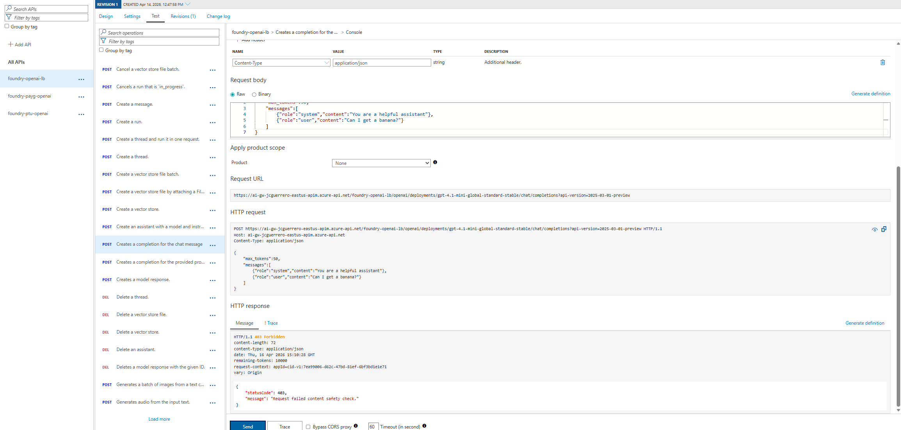

# Azure API Management

## Checklist

So far we've accomplished the following:

- [x] Add APIM-to-Foundries _"Cognitive Services"_ **Managed Identity** Role Assignments
- [x] Connect APIM backends to both CognitiveServices APIs in their respective Foundries.
- [x] Make sure it uses System Managed Identity against `https://cognitiveservices.azure.com/`
- [x] Create a Load Balancer for the Cognitive Services backends
- [ ] Created reusable Policy fragments
- [ ] Created new Products that use those policies

Now, let's test it!

## APIs

To test the `bananas` blocklist we created in previous steps, we'll put it directly on the `foundry-openai-lb`, as it is easier to test it in APIM using the APIs > Test feature.

### foundry-openai-lb

1. APIM > APIs > APIs
2. `foundry-openai-lb` > Design > Inbound processing

Add the following policy fragment to the inbound policies of the `foundry-openai-lb` API.

```xml
<llm-content-safety
  backend-id="foundry-cognitiveservices-lb"
  shield-prompt="false"
  enforce-on-completions="true"
>
  <blocklists>
    <id>bananas</id>
  </blocklists>
</llm-content-safety>
```

Resulting in

```xml
<policies>
    <inbound>
        <base />
        <set-backend-service id="apim-generated-policy" backend-id="foundry-openai-lb" />
        <llm-token-limit remaining-quota-tokens-header-name="remaining-tokens" remaining-tokens-header-name="remaining-tokens" tokens-per-minute="1000" token-quota="10000" token-quota-period="Hourly" counter-key="@(context.Subscription.Id)" estimate-prompt-tokens="true" tokens-consumed-header-name="consumed-tokens" />
        <llm-content-safety backend-id="foundry-cognitiveservices-lb" shield-prompt="false" enforce-on-completions="true">
            <blocklists>
                <id>bananas</id>
            </blocklists>
        </llm-content-safety>
    </inbound>
    <!-- ... -->
</policies>
```

#### Test

##### Positive test

```json
{
  "max_tokens": 50,
  "messages": [
    { "role": "system", "content": "You are a helpful assistant" },
    { "role": "user", "content": "Can I get an apple?" }
  ]
}
```

Responds

```json
{
  ...
  "message": {
      "annotations": [],
      "content": "I don't have the ability to provide physical items, but I can help you with information about apples or recipes if you'd like!",
      "refusal": null,
      "role": "assistant"
  },
  ...
}
```

> [!IMPORTANT]
> This is the make-it-or-break-it test for the content safety policy.

If ANYTHING is missing, you will ALWAYS get the following.-

```json
{
  "statusCode": 403,
  "message": "Request failed content safety check."
}
```

Which is SUPER misleading (I would expect a 500 error of sorts).

##### Negative test

##### On User Input

```json
{
  "max_tokens": 50,
  "messages": [
    { "role": "system", "content": "You are a helpful assistant" },
    { "role": "user", "content": "Can I get a banana?" }
  ]
}
```

**Responds**

```json
{
  "statusCode": 403,
  "message": "Request failed content safety check."
}
```



##### On Output

Now, we'll try to trick LLM to say "banana", by asking the scientific name of a banana: "Musa acuminata"

```json
{
  "max_tokens": 50,
  "messages": [
    { "role": "system", "content": "You are a helpful assistant" },
    { "role": "user", "content": "What is a Musa acuminata?" }
  ]
}
```

**Responds**

```json
{
  "statusCode": 403,
  "message": "Request failed content safety check."
}
```

## Next

[Back to Module](../README.md)
