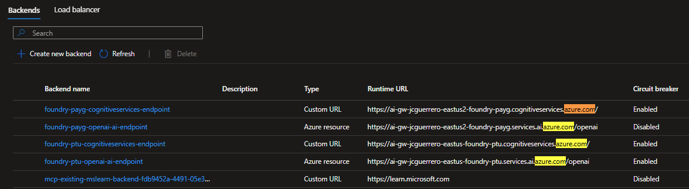

# Azure API Management

The same way we created the `foundry-openai-lb` load balancer, we will create a load balancer for the Cognitive Services backends.

Exposing this load balancer as an API tho is optional, and should only be done if you are planning to do something like groundedness check on the client side of things.

## Backends

### Backend endpoints

When we're done, it will look something like this

#### foundry-ptu-cognitiveservices

##### Create new backend

1. APIM > APIs > Backends
1. [ + Create new backend ]

- **Name**: `foundry-ptu-cognitiveservices-endpoint`
- **Runtime URL**: `https://ai-gw-{stack-id}-eastus-foundry-ptu.cognitiveservices.azure.com/`
- **Authorization credentials**
  - **Managed Identity**
    - [x] Enable
    - **Resource ID**: `https://cognitiveservices.azure.com/`

> [!IMPORTANT]
> Managed Identity tells APIM that it will authenticate against foundry, via the `https://cognitiveservices.azure.com/` URL

##### Circuit breaker

We will add a Circuit breaker policy, but this time, for any error `400-599`

- **Rule name**: `AnyFailure`
- **Failure Conditions**:
  - **Failure count**: `3`
  - **Failure interval**:
    - **Minutes**:`1`
- **Custom Range**: `400-599`
- **Trip duration**:
  - **Minutes**: `5`

#### foundry-payg-cognitiveservices

Follow the same steps as above to create a new backend for

- **Name**: `foundry-payg-cognitiveservices`
- **Runtime URL**: `https://ai-gw-{stack-id}-eastus2-foundry-payg.cognitiveservices.azure.com/`

### Load balancer

- Name: `foundry-cognitiveservices-lb`
- Add backends to pool
  - `foundry-ptu-cognitiveservices-endpoint`
  - `foundry-payg-cognitiveservices-endpoint`
- Backend weight and priority:
  - [x] Send requests evenly

## Checklist

So far we've accomplished the following:

- [x] Add APIM-to-Foundries _"Cognitive Services"_ **Managed Identity** Role Assignments
- [x] Connect APIM backends to both CognitiveServices APIs in their respective Foundries.
- [x] Make sure it uses System Managed Identity against `https://cognitiveservices.azure.com/`
- [x] Create a Load Balancer for the Cognitive Services backends
- [ ] Created reusable Policy fragments
- [ ] Created new Products that use those policies

Now, let's test it!

## Next

[Back to Module](../README.md)
