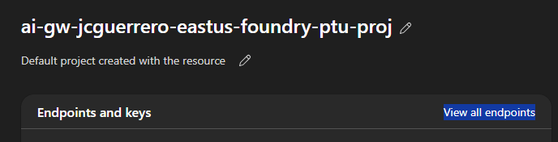
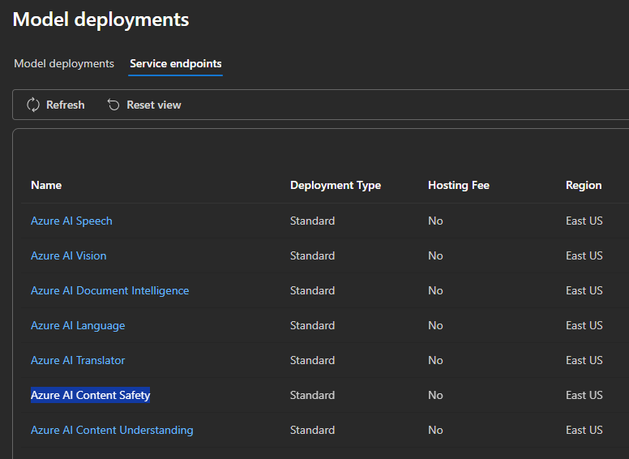

# Foundry

## Cognitive Services

Aside from OpenAI, MS Foundry exposes several other services as endpoints. One of them being the Content-safety service.

It's the same Content-safety that each Deployment Model Guardrails policy uses to ensure that the content generated by the models adheres to safety guidelines. You can in fact create a stand-alone content-safety service to use independently of the OpenAI models.

However, we're just going to benefit that MS Foundry comes "with batteries included"

1. Foundry > Portal
1. For this, ensure you're using **Classic view**

> [!NOTE]
> There must be a way to do this in the **New experience** as well

1. Overview
2. Click on "View all endpoints"

5. Which will take you to "Model + endpoints" > "Service endpoints"

6. Click on "Azure AI Content Safety"

> [!IMPORTANT]
> **Make note of this URL**

`https://ai-gw-{stack-id}-eastus-foundry-ptu.cognitiveservices.azure.com/`

And the same for `-eastus2-foundry-payg`

## Next

[Back to Module](../README.md)
