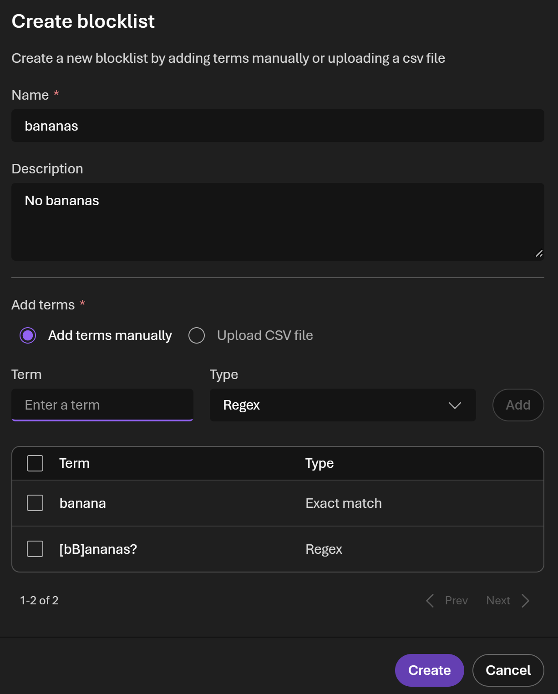
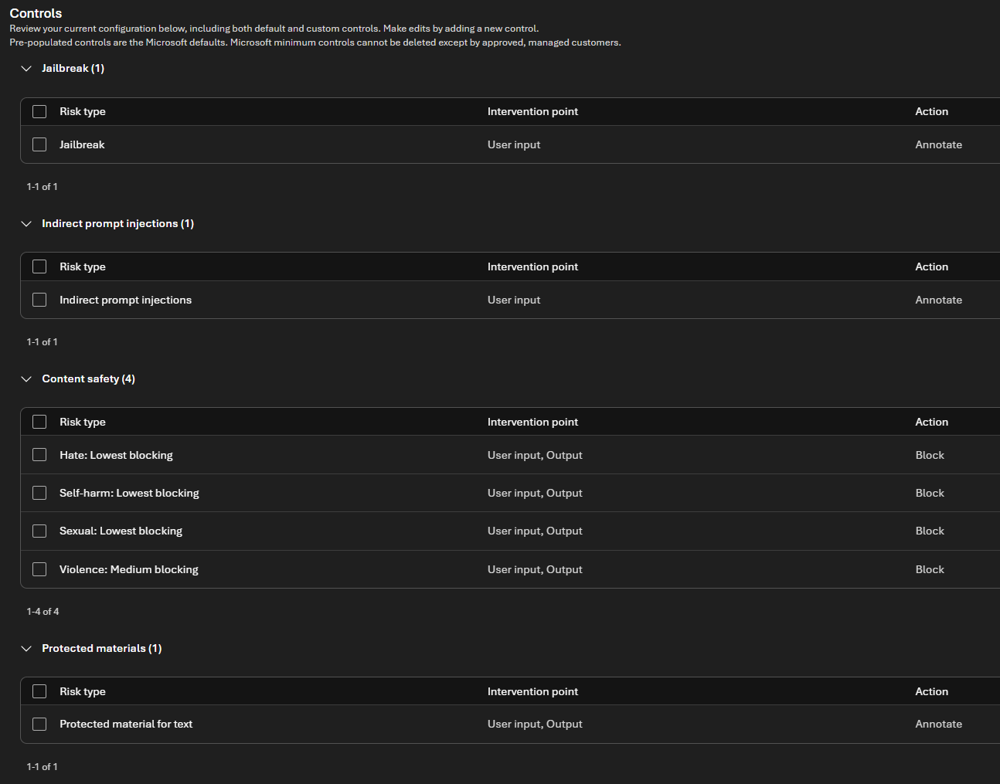

# Foundry

## -eastus-foundry-ptu

Because we want to move content-safety checks from LLM deployments to APIM, we'll create a log-only guardrail policies.

### Blocklists

We'll create a block list to disallow the word "apple"

1. Foundry > Overview > [ Go to Foundry portal ]
1. Make sure you're in the "New Foundry" experience
1. Build > Guardrails > Blocklists
1. ( Create )

- Name: bananas
- Add terms manually

| term        | type        |
| ----------- | ----------- |
| banana      | Exact match |
| [bB]ananas? | Regex       |

> [!TIP]
> Yes, Regex usecase renders the exact match useless.
> It's only to showcase how to add exact terms, VS regex terms.

### Guardrails

#### Basic policy

1. Build > Guardrails > Guardrails
2. ( Create )

> [!IMPORTANT]
> This is a Guardrail **policy**. I don't understand why the portal refuses to name it as such.

##### Add controls

Start by deleting all default controls.

> [!IMPORTANT]
> You won't be able to delete Content safety controls.

They will end up something like this:

> [!NOTE]
> This tutorial is focused on Models, not agents.
> So we won't include any Tool call and/or response

###### Content Safety

Because the UI will not allow us to just annotate, we'll have to make all of these "Lowest blocking"

So for `Hate`, `Self-harm`, `Sexual` & `Violence`:

- Severity level: Lowest blocking
- [x] User input
- [x] Output
- **Action**: Block

> [!NOTE]
> We could also add our "bananas" blocklist here to prevent the model from generating content related to bananas.
> However, we can also do that on the APIM side to enforce content safety checks before the request reaches the model.

- [x] **User input**
- **Action**: Block

For more information, see [Harm categories and severity levels in Microsoft Foundry](https://learn.microsoft.com/en-us/azure/foundry/openai/concepts/content-filter-severity-levels?tabs=warning)

###### Jailbreak

- [x] **User input**
- **Action**: Annotate

For more information, see [Prompt Shields in Microsoft Foundry](https://learn.microsoft.com/en-us/azure/foundry/openai/concepts/content-filter-prompt-shields)

###### Indirect prompt injections

- [x] **User input**
- **Action**: Annotate

###### Protected materials

We'll use "Protected material for text"

- [x] **User input**
- [x] **Output**
- **Action**: Annotate

For more information, see [Protected material detection filter](https://learn.microsoft.com/en-us/azure/foundry/openai/concepts/content-filter-protected-material?tabs=text)

###### Preview features

The following are currently not supported in APIM (at least not out of the box) and ONLY supported in Foundry:

- [Spotlighting](https://techcommunity.microsoft.com/blog/azure-ai-foundry-blog/better-detecting-cross-prompt-injection-attacks-introducing-spotlighting-in-azur/4458404)
- [[P]ersonally [I]dentifiable [I]nformation (PII) filter](https://learn.microsoft.com/en-us/azure/foundry/openai/concepts/content-filter-personal-information)

##### Select agents and models

Select both deployment models

## -eastus2-foundry-payg

We'll do the same we did for `ptu`

## Next

[Back to Module](../README.md)
