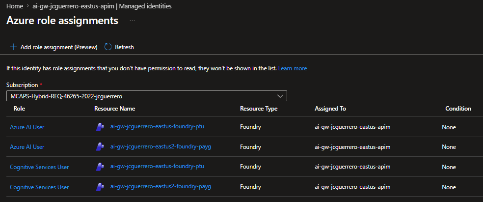

# APIM to Foundry RBAC

Before we begin, we need to do this. Unfortunately, (to my knowledge) this step needs to be done manually using az cli.

## Security

We've defined against what endpoint APIM will authenticate against (`https://cognitiveservices.azure.com/`). But we haven't specified what role APIM will assume.

This is no different than identifying yourself outside a door, but not being let in.

### Managed identities

#### Azure role assignments

1. APIM > Security > Managed identities
1. Click [ Azure role assignments ]

Now, we need to manually assign the appropriate Azure roles to the managed identity used by APIM so it can access the Cognitive Services endpoints.

## AZ CLI

### "Cognitive Services User" Role Id

Run

```
$> az role definition list --name "Cognitive Services User"
```

It should return something like

```json
[
  {
    "assignableScopes": ["/"],
    "createdBy": null,
    "createdOn": "2018-08-08T23:23:43.770127+00:00",
    "description": "Lets you read and list keys of Cognitive Services.",
    "id": "/subscriptions/{subscriptionId}/providers/Microsoft.Authorization/roleDefinitions/a97b65f3-24c7-4388-baec-2e87135dc908",
    ...
```

Make note of this guy.-

```
"id": "/subscriptions/{subscriptionId}/providers/Microsoft.Authorization/roleDefinitions/a97b65f3-24c7-4388-baec-2e87135dc908",
```

### APIM Service Principal Object Id

Then, we need to get the Object Id of the APIM service principal. This can be done using the Azure CLI:

```bash
$> az apim show \
  --resource-group ai-gw-{stack-id}-rg \
  --name ai-gw-{stack-id}-eastus-apim \
  --query identity.principalId \
  --output tsv
```

Which should return a GUId

`8-4-4-4-12`

### Create Role assignment

```bash
az role assignment create \
  --assignee {APIM Service Principal Object GUId} \
  --role "Cognitive Services User" \
  --scope /subscriptions/{subscriptionId}/resourceGroups/ai-gw-{stack-id}-rg/providers/Microsoft.CognitiveServices/accounts/ai-gw-{stack-id}-eastus-foundry-ptu
```

And it should reply w/

```json
{
  "condition": null,
  "conditionVersion": null,
  "createdBy": null,
  "createdOn": "2026-04-15T20:45:27.008045+00:00",
  "delegatedManagedIdentityResourceId": null,
  "description": null,
  "id": "/subscriptions/subscriptionId/resourceGroups/ai-gw-{stack-id}-rg/providers/Microsoft.CognitiveServices/accounts/ai-gw-{stack-id}-eastus-foundry-ptu/providers/Microsoft.Authorization/roleAssignments/6315dfc7-dbf6-4d8a-b7bb-c49264465664",
  "name": "6315dfc7-dbf6-4d8a-b7bb-c49264465664",
  "principalId": "48da1b46-a305-4f4b-92ca-f30824e1bcb2",
  "principalType": "ServicePrincipal",
  "resourceGroup": "ai-gw-{stack-id}-rg",
  "roleDefinitionId": "/subscriptions/subscriptionId/providers/Microsoft.Authorization/roleDefinitions/a97b65f3-24c7-4388-baec-2e87135dc908",
  "scope": "/subscriptions/subscriptionId/resourceGroups/ai-gw-{stack-id}-rg/providers/Microsoft.CognitiveServices/accounts/ai-gw-{stack-id}-eastus-foundry-ptu",
  "type": "Microsoft.Authorization/roleAssignments",
  "updatedBy": "7f2a60af-69de-4676-90f5-686a872b8521",
  "updatedOn": "2026-04-15T20:45:27.515048+00:00"
}
```

Now do the same for `ai-gw-{stack-id}-eastus2-foundry-payg`

## Result

Go back to the Azure role assignments section

Now it should look like this



## WARNING

> [!WARNING]
> If you were not able to complete this section, skip this module completely!

Everything else builds upon this part.

## Next

[Back to Module](./README.md)
