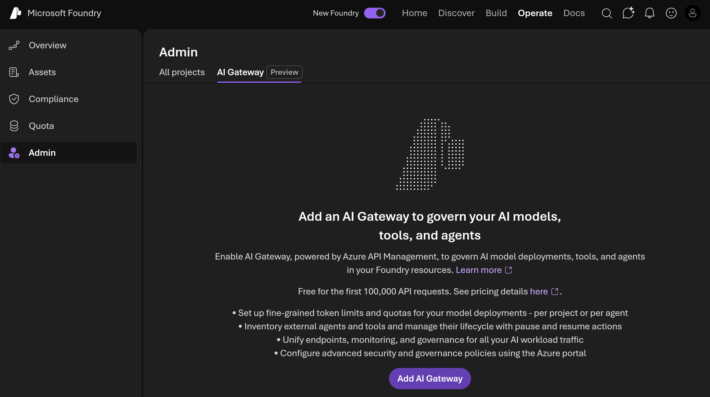
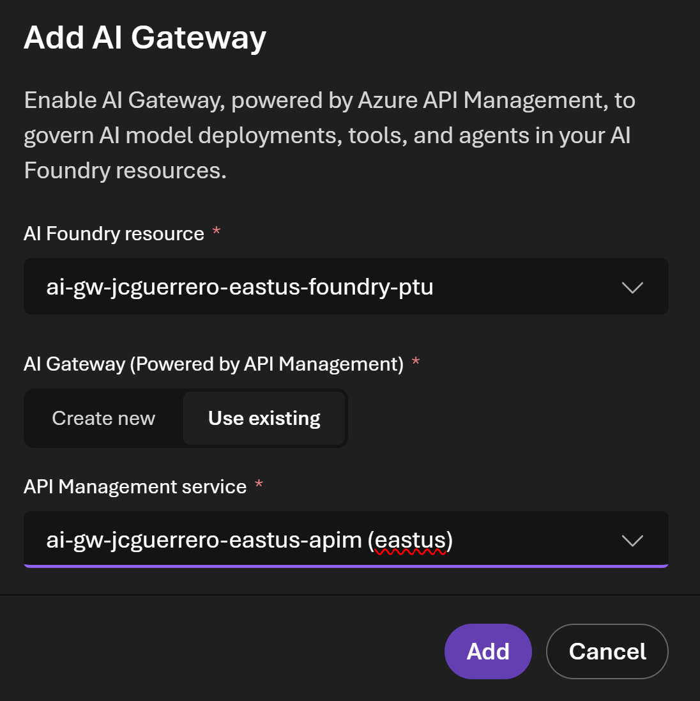
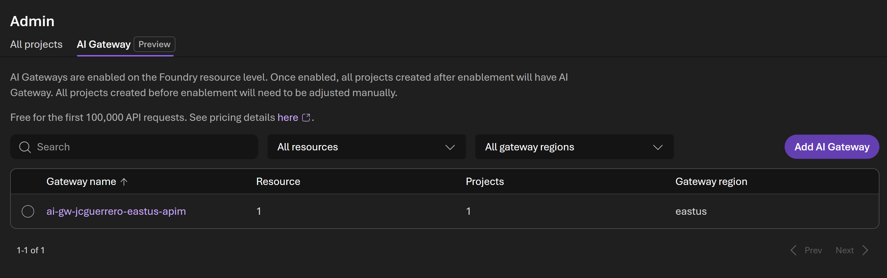

# AI GateWay

## Foundry

### Operate

#### Admin

##### eastus-foundry-ptu

1. Foundry > [ Go to Foundry portal ]
1. Ensure you're using the new experience
1. [ Operate ] tab
1. **Admin** blade menu
1. ( Add AI Gateway ) button

- Pick the `-ptu` existing instance
- Pick the existing `apim` instance

Then it will look like this:

#### eastus2-foundry-payg

Now do the same for `eastus2-foundry-payg`.

## APIM

### APIs

1. Go to APIM > APIs > APIs
1. Answer the following questions:

- What APIs did foundry create?
  - What inbound policies does it have?
  - What operations does it have?
    - Look at the Settings

### Backends

#### Backend endpoints

1. Now go to APIM > APIs > Backends
1. Answer the following questions:

- What backends did foundry create?
  - What is the resource ID for **Managed Identity**?
  - Is it different from the ones created by foundry?
  - Are there any policies applied to the backends?

### Load balancer

- Can you create another load balancer for the new backends?
- What policies from the APIs will you include, and which ones you won't? Why?
- Is it easier to clone and cleanup? or creating it from scratch?

### Products

1. APIM > Products
1. Answer the following questions:

- What products did foundry create?
- What subscriptions did foundry create?
  - **Take note of the Primary key**

## Back to Foundry

Now go back to foundry

### Build

#### Models

1. Foundry > Build > Models
1. Select any model
1. [ Details ] Tab
1. Unhide "Key" field
1. And answer the following questions:

- What do you see?
- Have you seen that value before?

### Operate

#### Admin

##### AI Gateway

1. Try to remove the Foundry instance And project "from gateway"

- What happens?
- What can or cannot do?
- What happened to the API keys?

## Next

[Back to Module](./README.md)
