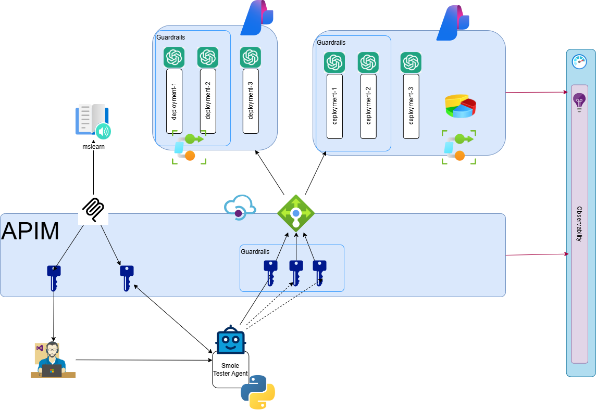

# AI Gateway for Developers Tutorial

## Before you begin

This guide follows loosely the recommended abbreviations.

- [Abbreviation recommendations for Azure resources](https://learn.microsoft.com/en-us/azure/cloud-adoption-framework/ready/azure-best-practices/resource-abbreviations)
- [The Azure Periodic Table](https://www.azureperiodictable.com/)

With some exceptions for clarity: i.e. `-foundry-` instead of `aif`, which in my brain sounds like "As-if"

### About links

Because creating linked markdown files is cumbersome, they all have a simple "return to parent" link.

This allows to move content around based on feedback

> [!TIP]
> Open links w/ Ctrl+Click to open in a new tab.

## Modules

1. [Foundry & logging infrastructure](./01/README.md)
1. [LLM Deployment models & smoke testing](./02/README.md)
1. [Azure API Management (APIM)](./03/README.md)
1. [APIM Load Balancing + App Insights](./04/README.md)
1. [MCP Servers in APIM](./05/README.md)
1. [APIM Users, Products, Subscriptions & Policy Fragments](./06/README.md)
1. [Content-Safety](./07/README.md)

## Architecture

## Resources

### Tech Community

- [Spotlighting (cross-prompt injection attack detection)](https://techcommunity.microsoft.com/blog/azure-ai-foundry-blog/better-detecting-cross-prompt-injection-attacks-introducing-spotlighting-in-azur/4458404)

### MS Learn

- [Tutorial: Use Log Analytics](https://learn.microsoft.com/en-us/azure/azure-monitor/logs/log-analytics-tutorial)
- [Secure access to MCP servers in API Management](https://learn.microsoft.com/en-us/azure/api-management/secure-mcp-servers)
- [Reuse policy configurations in your API Management policy definitions](https://learn.microsoft.com/en-us/azure/api-management/policy-fragments)
- [Tutorial: Create and publish a product](https://learn.microsoft.com/en-us/azure/api-management/api-management-howto-add-products?tabs=azure-portal&pivots=interactive)
- [Policies in Azure API Management](https://learn.microsoft.com/en-us/azure/api-management/api-management-howto-policies)
- [Limit call rate by subscription](https://learn.microsoft.com/en-us/azure/api-management/rate-limit-policy)
- [Enforce content safety checks on LLM requests](https://learn.microsoft.com/en-us/azure/api-management/llm-content-safety-policy)
- [How to manage user accounts in Azure API Management](https://learn.microsoft.com/en-us/azure/api-management/api-management-howto-create-or-invite-developers)
- [Authorize developer accounts by using Microsoft Entra ID in Azure API Management](https://learn.microsoft.com/en-us/azure/api-management/api-management-howto-aad)
- [Harm categories and severity levels in Microsoft Foundry](https://learn.microsoft.com/en-us/azure/foundry/openai/concepts/content-filter-severity-levels?tabs=warning)
- [Prompt Shields in Microsoft Foundry](https://learn.microsoft.com/en-us/azure/foundry/openai/concepts/content-filter-prompt-shields)
- [Protected material detection filter](https://learn.microsoft.com/en-us/azure/foundry/openai/concepts/content-filter-protected-material?tabs=text)
- [Personally Identifiable Information (PII) filter](https://learn.microsoft.com/en-us/azure/foundry/openai/concepts/content-filter-personal-information)

### Related trainings

- [Azure Secure Networking for Devs](https://github.com/percebus/azure-secure-networking-for-devs/)
