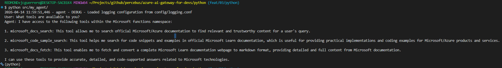

# python AI smoke tester

## Pre-requisites

1. `uv`

## Setup

1. `$> uv venv`
1. Activate `.venv`
1. `$> uv sync --locked --all-extras`

### .env

1. Copy+paste `.env.example` to `.env`
2. Fill in the required environment variables.

## Run

`$> python src/my_agent`

Returns something like.-



```
User: What tools are available to you?
Agent: I have access to a set of tools focused on Microsoft and Azure technologies documentation and coding examples:

1. microsoft_docs_search: Search official Microsoft/Azure documentation to find relevant content for a user's query.
2. microsoft_code_sample_search: Search for code snippets and examples in official Microsoft Learn documentation.
3. microsoft_docs_fetch: Fetch and convert a Microsoft Learn documentation webpage to markdown format for complete step-by-step procedures or tutorials.

These tools help me provide accurate, detailed, and up-to-date information and code examples related to Microsoft and Azure technologies.
```
